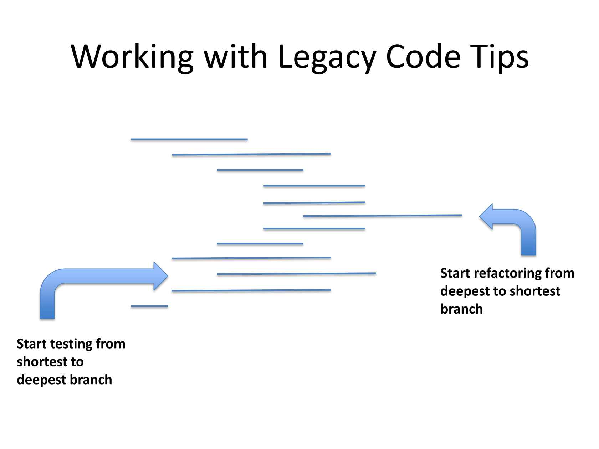

# Trip Service Kata - Format learning hour
Tiré du kata d'oringe de [Sandro Mancuso](https://github.com/sandromancuso/trip-service-kata)

L'idée est de faire un premier atelier sous le format learning hour, et continuer le kata si l'équipe accroche / voit l'intérêt

## Learning goals
* Comprendre la stratégie du shallow test / deep refactoring
* Être capable de mettre en oeuvre le pattern du seam (joint)
* Comprendre l'intérêt de la mise en place de tests avant de refactorer

## Connect (5')
Classer les snippets suivant selon la difficulté à tester la méthode:


- L'intérêt est d'amorcer une discussion / réflexion sur l'exercice à venir, en prenant un bout de code simplifié mais très similaire. 
  - Si l'équipe a déjà vu le `tell don't ask`, on peut les amener à identifier ce smell sur le snippet 3.

## Démo (10')
Expliquer la nécessité de mettre en place une couverture de code satisfaisante avant de refactorer, ce schéma peut aider:


- Coder le premier test (partir du commit `fix(seam): nullabilite user`). 
  - On arrive normalement à la base de code actuelle.

### Détail démo
Test from shortest branch, on part sur le TripService, le premier test se fait sur l'exception
```c#
[Fact]  
public void should_throw_exception_when_user_is_not_logged()  
{  
    // arrange  
    var tripService = new TripService();  
    // act  
    // assert
    Assert.Throws<UserNotLoggedInException>(() => tripService.GetTripsByUser(new User()));  
}
```

- Le test casse, on va extraire la ligne problématique, via l'ide (ctrl+alt+m) --> mise en place du seam
  - Faire en sorte de pouvoir la surcharger -> passer en protected virtual en C#
```C#
protected virtual User.User? GetLoggedUser()  
{  
    return UserSession.GetInstance().GetLoggedUser();  
}
```

- puis on génére la classe interne
```c#
[Fact]  
public void should_throw_exception_when_user_is_not_logged()  
{  
    // arrange  
    TripService tripService = new TestableTripService();  
    // act  
    // assert    Assert.Throws<UserNotLoggedInException>(() => tripService.GetTripsByUser(new User()));  
}  
  
public class TestableTripService : TripService  
{  
    protected override User? GetLoggedUser()  
    {        return null;  
    }}
```

## Practice
- Continuer l'ajout des tests jusqu'à couvrir l'ensemble du code. 
- Il y aura un autre seam à faire pour la `DAO`, et la nécessité d'ajouter la paramétrisation au user retourné par le GetLoggedUser.
- Possibilité d'utiliser des `tests data builders` si l'équipe connaît le pattern.

Si il reste du temps, enchaîner sur la partie refacto.

## Conclusion (5')
- Voyez-vous des éléments de votre code où appliquer cette stratégie test/refacto ? 
  - Où utiliser les seams pour mettre en place une première couche de tests ?