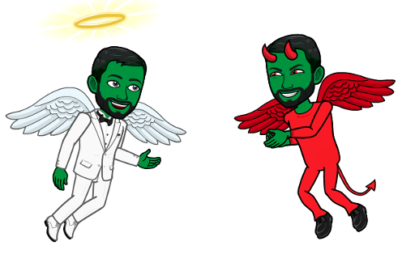
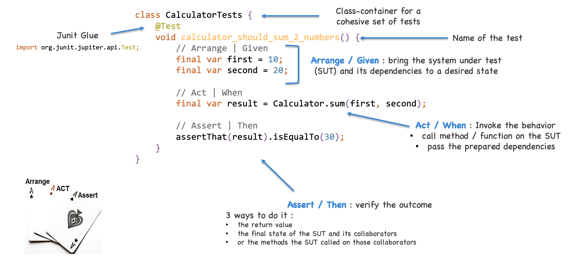

# Test anatomy
## Learning Goals
- Demystify what are Unit Tests
- Understand the importance of the 3 test parts

## Connect - MythBusters
In small groups, categorize each sentence about Unit tests in :
- Myth
- Truth

### Sentences
- It makes changes more difficult to make
- Using them, I don't have a piece of code that I'm afraid to touch
- Unit tests are only written by testers
- My code is so simple, so I do not need to write a single test on it
- Unit tested code is of higher quality than not tested code
- You only need unit testing when there are many developers
- It reduces the cost of development
- It takes too much time to write

### Correction
#### Myths
- It makes changes more difficult to make
  - Makes changes easier to make 
  - Let developers refactor without fear (again, again, and again)
- Unit tests are only written by testers 
  - Usually, they don’t… 
  - Developers write unit tests 
  - Ideally run them every time they make any change on the system
- My code is so simple, I do not need to write a single test on it 
  - Simple code requires simple tests, so there are no excuses.
- You only need unit testing when there are many developers 
  - Unit testing can help a one-person team just as much as a 50-person team 
  - Even more risky to let a single person hold all the cards
- It takes too much time to write 
  - It takes a little while to get used to, but overall will save you time and cut down on wasted time 
  - Regression testing will keep things moving forward without having to worry too much 
  - `How do you test your development if you do not write Unit tests?`

> Our responsibility is to reduce the cost of quality

#### Facts
- Using them, I don't have a piece of code that I'm afraid to touch 
  - When you refactor / add new features it acts as a safety net and increase your confidence
- Unit tested code is of higher quality than not tested one 
  - It identifies every defect that may have come up before code is sent further for integration testing 
  - Writing tests makes you think harder about the problem 
  - It exposes the edge cases and makes you write better code
- It reduces the cost of development 
  - Since the bugs are found early, unit testing helps reduce the cost of bug fixes 
  - Bugs detected earlier are easier to fix

## Concepts
### What is a Unit Test?
A unit test is an automated test that :
- Verifies a small piece of code (also known as a unit)
- Does it quickly
- And does it in an isolated manner.

### What makes a successful test suite?
- Integrated into the development cycle 
  - Ideally : execute them on every change
-Targets the most important parts of your code base 
  - `Domain model` – contains the business logic (gives the best ROI)
- Provides maximum value with minimum maintenance costs 
  - Recognizing a valuable test (and, by extension, a test of low value)
  - Writing a valuable test

### Complete anatomy

- Name your tests class has a container for a cohesive set of tests
- Don’t follow a rigid naming policy
  - You simply can’t fit a high-level description of a complex behavior into the narrow box of such a policy
  - Allow freedom of expression
- Name the test as if you were describing the scenario to a non-programmer who is familiar with the problem domain 
  - A domain expert or a business analyst should understand it
- Use sentences
  - Express a true business specification
  - Doing so helps improve readability, especially in long names

- Test case structuration using `Arrange - Act - Assert`:
  - helps keep tests readable
  - exposes the tested behavior

> Unit Testing is not a secondary activity, it’s the primary one of a good developer !!!

## Concrete Practice - Yellow Submarine
Based on previous learning, let's add missing tests on the `Submarine`.
Follow instructions [here](dive/README.md)

## Conclusion
In your own words, explain why using the Arrange - Act - Assert pattern improves test maintainability. 

Write a sentence or two on a note and share it with the group.