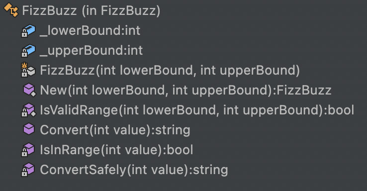

# Properties of Good Unit Tests

## Learning Goals

- Remember properties of Good Unit Tests
- Apply strategy on Unit Tests that make them compliant with those properties

## Connect - Characteristics

- Open the solution `Test-Characteristics`
- Then open the test class `FizzBuzzShould`
- Identify what are the problems / improvement possible on those tests

Let's use your observation in the `Concrete Practice` part.

## Concepts

### 3 pillars and 1 foundation


To create tests that are more resistant to refactoring we invite you to deep dive into `Test Data Builders`
and `Mocking` topics.

### Apply F.I.R.S.T principles


Go beyond `F.I.R.S.T principles` with [Test Desiderata](https://kentbeck.github.io/TestDesiderata/)

## Concrete Practice - F.I.R.S.T FizzBuzz tests

In mob, let's fix the tests to make them respect the F.I.R.S.T principles

### Isolation

If you run all the tests each test should be green


What happens if you run the `Return_Buzz_For_Multiples_Of5` test?


Why does it happen?

```csharp
private static FizzBuzz _fizzBuzz;

[Theory]
[InlineData(3)]
[InlineData(12)]
[InlineData(81)]
public void Return_Fizz_For_Multiples_Of3(int value)
{
    _fizzBuzz = FizzBuzz.New();
    _fizzBuzz.Convert(value)
        .Should()
        .Be("Fizz");
}

[Theory]
[InlineData(5)]
[InlineData(25)]
[InlineData(95)]
public void Return_Buzz_For_Multiples_Of5(int value) =>
    _fizzBuzz.Convert(value)
        .Should()
        .Be("Buzz");
```

The `_fizzBuzz` field is instantiated statically by the test `Return_Fizz_For_Multiples_Of3`.
If this test has been ran before the test we want to run, the test is green otherwise not.

### Self-validating

A test is not `self-validating` -> `Return_The_Value_For_Others`.

Here is an example of poor assertion...

```csharp
[Theory]
[InlineData(1)]
[InlineData(23)]
[InlineData(76)]
public void Return_The_Value_For_Others(int value) =>
    _fizzBuzz.Convert(value)
        .Should()
        .NotBeNull("Should return something")
        .And
        .StartWith("Simple Value :");
```

### Repeatable

One of our test contains a mistake in the assertions.
But because we use a `random` value, most of the time our test is green...


This test is non deterministic because of that.

```csharp
// What is a valid string?
// How could we rename this test case?
[Fact]
public void Return_Valid_String()
{
    var random = new Random();
    // What is a Valid Int
    var randomInt = ValidInt(random);

    _fizzBuzz.Convert(randomInt)
        .Should()
        // One of is a smell that we may work on a too generic input
        .BeOneOf("Fizz", "Buzz", "FizzBuz");
}

public static int ValidInt(Random random)
{
    while (true)
    {
        var randomInt = random.Next(1, 100);
        if (randomInt % 3 == 0 || randomInt % 5 == 0)
        {
            return randomInt;
        }
    }
}
```

> Which other stuff do you manipulate in your unit tests can be non deterministic?

### Thorough

If you take a look at the public `API` of `FizzBuzz` and test cases, they are not thorough.
They only cover happy paths.




> What are the edge cases?

### Fast

One of the test in this suite is taking long time to run... (more than 6 seconds)


If a test takes a long time to run it won't be run anymore. People will tempt to skip it...

```csharp
[Fact(Skip = "Too long")]
public void Write_Results_With_Big_FizzBuzz_For_Human_Validation()
```

> Let's analyze the test and identify what can be done about it.

As usual, a step-by-step solution is available [here](step-by-step.md)

## Conclusion

Identify 3 tests in your current context that can be improved regarding those principles.