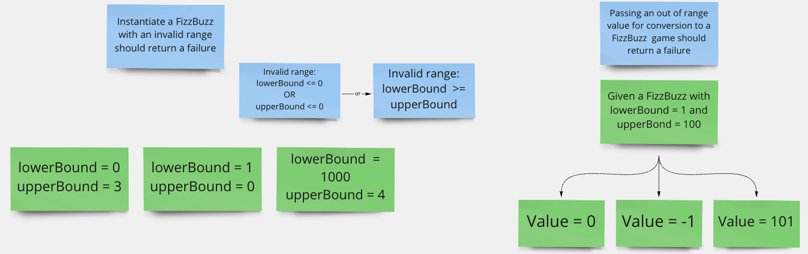

## Isolation

Let's use correctly our test library to instantiate a `FizzBuzz` object for each of our test:

- Instantiate the `_fizzBuzz` field from the Test class constructor
- Make it `readonly` and `non static`

```csharp
public class FizzBuzzShould
{
    private const string ResultFile = "results.txt";
    private readonly FizzBuzz _fizzBuzz;

    public FizzBuzzShould() => _fizzBuzz = FizzBuzz.New();
    ...
}
```

Our tests are now isolated from each others.

## Self-validating

Let's improve validation of the `Return_The_Value_For_Others` theory by asserting the expected value.

```csharp
[Theory]
[InlineData(1, "Simple Value : 1")]
[InlineData(23, "Simple Value : 23")]
[InlineData(76, "Simple Value : 76")]
public void Return_The_Value_For_Others(int value, string expectedResult) =>
    _fizzBuzz.Convert(value)
        .Should()
        .Be(expectedResult);
```

An assertion is not an approximation, we can not express that we expect `something` that is not null.
Whatever is valid...

## Repeatable

> What is the purpose of this test?

Validate the implementation of the business rules below:

- Return `Fizz` for multiples of 3
- Return `Buzz` for multiples of 5
- Return `FizzBuzz` for multiples of 15

All those rules are already been isolated in dedicated tests.
This test is a bad duplication of those.

> Simple solution -> remove duplication.

## Thorough

> What are the edge cases?

Here are some examples, it is just a sample.



Let's write the associated tests:

```csharp
public class Fail
{
    [Theory]
    [InlineData(0, 3)]
    [InlineData(1, 0)]
    [InlineData(1000, 4)]
    public void WhenInstantiatingAFizzBuzzWithInvalidRange(int lowerBound, int upperBound)
    {
        var newFizzBuzz = () => New(lowerBound, upperBound);
        newFizzBuzz
            .Should()
            .ThrowExactly<InvalidRangeException>();
    }

    [Theory]
    [InlineData(0)]
    [InlineData(-1)]
    [InlineData(101)]
    public void WhenAValueOutOfRange(int value) =>
        New()
            .Invoking(fizzBuzz => fizzBuzz.Convert(value))
            .Should()
            .ThrowExactly<NotInRangeException>();
}
```

We can isolate them in a dedicated test container class.

> Always remember that testing is always a sample. You can always find more test cases.

## Fast

> What is the purpose of this test?

- It generates a file containing the result of `FizzBuzz` for 50 000 values.
- No assertions at all
    - It only asserts that the file generated by the `FileUtils` contain the 50 000 lines expected by our business
      experts

```csharp
[Fact]
public void Write_Results_With_Big_FizzBuzz_For_Human_Validation()
{
    FileUtils.DeleteFile(ResultFile);

    const int lowerBound = 1;
    const int upperBound = 50_000;

    var bigFizzBuzz = New(lowerBound, upperBound);

    var result =
        Range(lowerBound, upperBound)
            .AsEnumerable()
            .Select(v => bigFizzBuzz.Convert(v))
            .Aggregate("", (acc, value) => $"{acc}{value}{Environment.NewLine}");

    FileUtils.AppendToFile(ResultFile, result);
    FileUtils.CountLines(ResultFile)
        .Should()
        .Be(upperBound);
}
```

The code inside this test is not really a test...
If needed by our domain experts, we can put this code in another assembly: maybe a `Console Application`.

It is not the responsibility of our unit tests to generate a report like this...