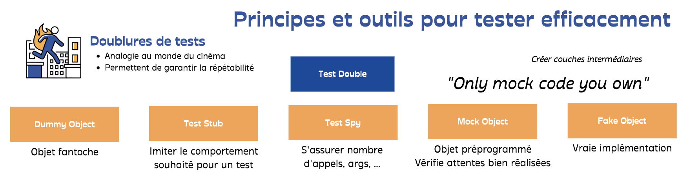

# Test Doubles

## Learning Goals

- Understand the different kinds of `Test Doubles`
- Clarify the vocabulary related to `Test Doubles`
- Explain their utility depending on the encountered problem

## Connect - Word Definition

Associate those words with their definitions below:

- `Test Double`
- `Spy`
- `Mock`
- `Fake`
- `Stub`
- `Dummy`
- `SUT`

Definitions:

- Replace an object the system under test (SUT) depends on with a test-specific object that verifies it is being used
  correctly by the SUT.
- Test Double to capture the indirect output calls made to another component by the system under test (SUT) for later
  verification by the test.
- We replace a component on which the Subject Under Test depends with a "test-specific equivalent."
- Replace a component that the SUT depends on with a much lighter-weight implementation.
- Subject Under Test
- We pass an object that has no implementation as an argument of a method called on the SUT.
- We replace a real object with a test-specific object that feeds the desired indirect inputs into the system under
  test.

### Correction

- `Test Double`: We replace a component on which the Subject Under Test depends with a "test-specific equivalent."
- `Spy`: Test Double to capture the indirect output calls made to another component by the system under test (SUT) for
  later verification by the test.
- `Fake`: Replace a component that the SUT depends on with a much lighter-weight implementation.
- `Stub`: We replace a real object with a test-specific object that feeds the desired indirect inputs into the system
  under test.
- `Mock`: Replace an object the system under test (SUT) depends on with a test-specific object that verifies it is being
  used correctly by the SUT.
- `Dummy`: We pass an object that has no implementation as an argument of a method called on the SUT.
- `SUT`: Subject Under Test

## Concepts - 50 Shades of Test Doubles

### Isolation

- One of the fundamental requirements of making Unit testing work is `isolation`
    - Isolation is hard in real world as there are always dependencies (collaborators) across the system


- That’s where concept of something generically called `Test Double` comes into picture
- A `Double` allow us to break the original dependency:
    - Helping isolate the unit / System Under Test (SUT)
    - As this Double is used to pass a unit test it’s generally referred to as `Test Double`

### Repeatability

In addition to `Isolation` they play a key role in ensuring `repeatability` of our tests as well by replacing external
dependencies:

- Call to an API
- Call to a database
- Non deterministic data : random or temporal for example

### Fast

We replace a component on which the SUT depends with a `test-specific equivalent.` -> that keeps our tests `Fast` in
addition of previously mentioned characteristics.
> There are variations in types of Test Doubles depending on their intent

### Dummy

> We pass an object that has no implementation as an argument of a method called on the SUT.

`Dummy` is a placeholder required to pass the unit test :

- Either the SUT does not exercise this placeholder
- Or its value has no impact on the end result

Dummy can be something as simple as passing `null` or a void implementation with exceptions to ensure it’s never
leveraged

```c#
 [Fact]
public void Should_Throw_An_ArgumentException_When_Divide_By_Zero()
{
    var calculator = new Calculator();
    const int numerator = 9;
    const int zero = 0;

    calculator.Invoking(_ => _.Divide(numerator, zero))
        .Should()
        .Throw<ArgumentException>();
}
```

- Here whatever the value of numerator it has no impact on the sut
- We could even replace it by:

```c#
var numerator = new Random().Next(); 
```

### [Fake](http://xunitpatterns.com/Fake%20Object.html)

> Replace a component that the SUT depends on with a much lighter-weight implementation.

Fake is used to simplify a dependency so that unit test can pass easily:

- A `real implementation` but simplified of a real class
- You can not use libraries to define them because it is a `Test Double` that requires a true implementation

```c#
[Fact]
public void Should_Notify_Twice_When_Receiving_A_Scenario_And_Having_Two_Clients()
{
    using var logs = new StringWriter();
    var registeredUsers = new List<Client>
    {
        new("Cliff Booth", "cliff.booth@double.com"),
        new("Rick Dalton", "rick.dalton@double.com")
    };

    var notifier = new FakeNotifier(text => logs.WriteLine(text));
    var scriptEventHandler = new ScenarioReceivedEventHandler(notifier, registeredUsers);

    scriptEventHandler.Handle(new ScenarioReceived("The 14 fists of McCluskey"));

    logs.ToString()
        .Should()
        .Contain(
            "Hello : Cliff Booth, I have just received a new scenario called 'The 14 fists of McCluskey' !!!")
        .And
        .Contain(
            "Hello : Rick Dalton, I have just received a new scenario called 'The 14 fists of McCluskey' !!!");
}

private class FakeNotifier : INotifier
{
    private readonly Action<string> _console;

    public FakeNotifier(Action<string> console) => _console = console;

    public void Notify(Client client, ScenarioReceived scenarioReceived) =>
        _console($"Hello : {client.Name}, I have just received a new scenario called '{scenarioReceived.Title}' !!!");
}
```

- You could run your production code with `fakes` for testing purpose on specific environment
- For the notifier example, you could use a `Fake` implementation on a `Test` environment in whcih instead of sending
  notifications will write in application logs

### [Stub](http://xunitpatterns.com/Test%20Stub.html)

> We replace a real object with a test-specific object that feeds the desired indirect inputs into the system under test.

- Stub is used to provide indirect inputs to the SUT coming from its collaborators / dependencies
    - These inputs could be in form of objects, exceptions or primitive values
- Help `to emulate and examine in-coming interactions`
- We replace a real object with a test-specific object that feeds the desired indirect inputs into the system under test

```c#
 [Fact]
public void Should_Divide_A_Numerator_By_A_Denominator_When_Authorization_Is_Accepted()
{
    var authorizerStub = new AllowAccessAuthorizer();
    var calculator = new Calculator(authorizerStub);

    calculator.Divide(9, 3)
        .Should()
        .Be(3);
}

[Fact]
public void Should_Divide_A_Numerator_By_A_Denominator_When_Authorization_Is_Denied()
{
    var authorizerStub = new DenyAccessAuthorizer();
    var calculator = new Calculator(authorizerStub);

    calculator.Invoking(_ => _.Divide(9, 3))
        .Should()
        .Throw<UnauthorizedAccessException>();
}

public class AllowAccessAuthorizer : IAuthorizer
{
    public bool Authorize() => true;
}

public class DenyAccessAuthorizer : IAuthorizer
{
    public bool Authorize() => false;
}
```

We could use a library for this purpose.

### [Spy](http://xunitpatterns.com/Mock%20Object.html)

> Use a Test Double to capture the indirect output calls made to another component by the system under test (SUT) for later verification by the test.

```c#
[Fact]
public async Task Create_A_Joke_Use_Case_Should_Save_Good_Jokes()
{
    var spyJokeRepository = new SpyJokeRepository();
    var useCase = new CreateAJokeUseCase(spyJokeRepository);
    var request = new CreateJokeRequest(
        "Anonymous",
        "Quelle partie du légume ne passe pas dans le mixer ? La chaise roulante"
    );

    await useCase.HandleAsync(request);

    spyJokeRepository
        .ShouldContain(request);
}

private class SpyJokeRepository : IJokeRepository
{
    private readonly List<Joke> _jokes = new();

    public Task Save(Joke joke)
        => Task.Run(() => _jokes.Add(joke));

    public void ShouldContain(CreateJokeRequest request, int expectedCount = 1) =>
        _jokes
            .Where(j => j.Author == request.Author && j.Text == request.Text)
            .Should()
            .HaveCount(expectedCount);
}
```

### [Mock](http://xunitpatterns.com/Mock%20Object.html)

> Replace an object the system under test (SUT) depends on with a test-specific object that verifies it is being used correctly by the SUT.

-

### Limits

> Only mock code you own

- Substituting an object from an external system may lead to major changes if the external object changes
    - Create an intermediate layer : use Adapter pattern for example



## Concrete Practice -

## Conclusion

### Resources

- [XUnit Test Patterns - Refacoring Test Code](http://xunitpatterns.com/)
- [Software craft - TDD, Clean Code et autres pratiques essentielles](https://www.dunod.com/sciences-techniques/software-craft-tdd-clean-code-et-autres-pratiques-essentielles)
- [Dummy vs. Stub vs. Spy vs. Fake vs. Mock](https://nirajrules.wordpress.com/2011/08/27/dummy-vs-stub-vs-spy-vs-fake-vs-mock/)