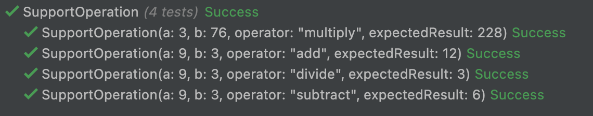

# Parameterized Tests
## Learning Goals
Apply `Parameterized Tests` on existing code

## Connect - Improvement?
In the tests below what can be improved?

```c#
public class CalculatorShould
{
    [Fact]
    public void SupportAdd()
    {
        // Arrange
        var calculator = new Calculator();

        // Act
        var result = calculator.Calculate(9, 3, Calculator.Add);

        // Assert
        Assert.Equal(12, result);
    }

    [Fact]
    public void SupportMultiply()
    {
        // Arrange
        var calculator = new Calculator();

        // Act
        var result = calculator.Calculate(3,76, Calculator.Multiply);

        // Assert
        Assert.Equal(228, result);
    }

    [Fact]
    public void SupportDivide()
    {
        // Arrange
        var calculator = new Calculator();

        // Act
        var result = calculator.Calculate(9,3, Calculator.Divide);

        // Assert
        Assert.Equal(3, result);
    }

    [Fact]
    public void SupportSubtract()
    {
        // Arrange
        var calculator = new Calculator();

        // Act
        var result = calculator.Calculate(9,3, Calculator.Subtract);

        // Assert
        Assert.Equal(6, result);
    }

    [Fact]
    public void FailWhenOperatorNotSupported()
    {
        var calculator = new Calculator();
        var exception = Assert.Throws<ArgumentException>(() => calculator.Calculate(9, 3, "UnsupportedOperator"));
    
        Assert.Equal("Not supported operator", exception.Message);
    }

    [Fact]
    public void FailWhenDividingByZero()
    {
        var calculator = new Calculator();
        var exception = Assert.Throws<DivideByZeroException>(() => calculator.Calculate(2, 0, Calculator.Divide));
    
        Assert.Equal("Attempted to divide by zero.", exception.Message);
    }
}
```

<details>
  <summary markdown='span'>
  Correction
  </summary>

- assertion code is duplicated
- we instantiate 1 `Calculator` per test, but we can use the same (no state inside)
- Weak assertions: prefer libraries that return more details on failure like `FluentAssertions`

</details>


## Concepts - xUnit and Parameterized Tests
Let's explore it together [here](https://andrewlock.net/creating-parameterised-tests-in-xunit-with-inlinedata-classdata-and-memberdata/)

### Demo - refactor to Theory
As facilitator, refactor the `Calculator` tests to use a `Theory`.

<details>
  <summary markdown='span'>
  Step by step
  </summary>

> You should pay the same attention to your tests as to your production code.

- Split the declaration of a test to make it easiest to automatically extract

```c#
[Fact]
public void SupportAdd()
{
    // Arrange
    var calculator = new Calculator();
    
    // Act
    var a = 9;
    var b = 3;
    var @operator = Calculator.Add;
    var expectedResult = 12;
    
    var result = calculator.Calculate(a, b, @operator);
    
    // Assert
    Assert.Equal(expectedResult, result);
}
```
- Extract a method from it

```c#
private readonly Calculator _calculator = new Calculator();

private void SupportOperation(int a, int b, string @operator, int expectedResult)
{
    var result = _calculator.Calculate(a, b, @operator);
    Assert.Equal(expectedResult, result);
} 
```

- All the tests must stay green
- Let's refactor this new method
  - Use `FluentAssertions`

```c#
private void SupportOperation(int a, int b, string @operator, int expectedResult) =>
    _calculator.Calculate(a, b, @operator)
        .Should()
        .Be(expectedResult);
```

- This method is ready to be changed as a `Theory`
  - Add the `Theory` attribute on it
  - Declare a first `InlineData`
  - Each time we add an `InlineData`, we can remove an `example` test

```c#
[Theory]
[InlineData(9, 3, Add, 12)]
private void SupportOperation(int a, int b, string @operator, int expectedResult) =>
    _calculator.Calculate(a, b, @operator)
        .Should()
        .Be(expectedResult);
```

- After we took test cases into the `Theory`, it looks like this

```c#
[Theory]
[InlineData(9, 3, Add, 12)]
[InlineData(3, 76, Multiply, 228)]
[InlineData(9, 3, Divide, 3)]
[InlineData(9, 3, Subtract, 6)]
private void SupportOperation(int a, int b, string @operator, int expectedResult) =>
    _calculator.Calculate(a, b, @operator)
        .Should()
        .Be(expectedResult);
```

- The impact on the test result:



### What about the limit test cases?
- What happens to our `Theory` if we want to handle passing and non passing data in the same one?
    - We should implement something like this
    - We would be forced to add complexity to our `Theory` with branches inside

```c#
[Theory]
[InlineData(9, 3, Add, 12)]
[InlineData(3, 76, Multiply, 228)]
[InlineData(9, 3, Divide, 3)]
[InlineData(9, 3, Subtract, 6)]
[InlineData(9, 3, "UnsupportedOperator", null, typeof(ArgumentException))]
private void SupportOperation(int a, int b, string @operator, int? expectedResult, Type? expectedExceptionType = null)
{
    if (expectedExceptionType != null)
    {
        _calculator.Invoking(_ => _.Calculate(a, b, @operator))
            .Should()
            .Throw(expectedExceptionType);
    }
    else
    {
        _calculator.Calculate(a, b, @operator)
            .Should()
            .Be(expectedResult);
    }
}
```

- 1 advice -> `Never have conditions in Parameterized Tests`
    - Have specific test cases for the edges
- Let's just refactor edge cases to remove duplication
- Like earlier: prepare a method extraction

```c#
[Fact]
public void FailWhenOperatorNotSupported()
{
    int a = 1, b = 3;
    var @operator = "UnsupportedOperator";
    var expectedMessage = "Not supported operator";

    _calculator
        .Invoking(_ => _.Calculate(a, b, @operator))
        .Should()
        .Throw<ArgumentException>()
        .WithMessage(expectedMessage);
}
```

- Then `extract method`

```c#
[Fact]
public void FailWhenOperatorNotSupported() 
    => AssertFailure<ArgumentException>(1, 3, "UnsupportedOperator", "Not supported operator");

[Fact]
public void FailWhenDividingByZero() 
    => AssertFailure<DivideByZeroException>(2, 0, Divide, "Attempted to divide by zero.");

private void AssertFailure<TExpectedException>(int a, int b, string @operator, string expectedMessage)
    where TExpectedException : Exception =>
    _calculator
        .Invoking(_ => _.Calculate(a, b, @operator))
        .Should()
        .Throw<TExpectedException>()
        .WithMessage(expectedMessage);
```

- At the end the test class looks like this:
```c#
public class CalculatorShould
{
    private readonly Calculator _calculator = new Calculator();

    [Theory]
    [InlineData(9, 3, Add, 12)]
    [InlineData(3, 76, Multiply, 228)]
    [InlineData(9, 3, Divide, 3)]
    [InlineData(9, 3, Subtract, 6)]
    private void SupportOperation(int a, int b, string @operator, int expectedResult) =>
        _calculator.Calculate(a, b, @operator)
            .Should()
            .Be(expectedResult);

    [Fact]
    public void FailWhenOperatorNotSupported() 
        => AssertFailure<ArgumentException>(1, 3, "UnsupportedOperator", "Not supported operator");

    [Fact]
    public void FailWhenDividingByZero() 
        => AssertFailure<DivideByZeroException>(2, 0, Divide, "Attempted to divide by zero.");

    private void AssertFailure<TExpectedException>(int a, int b, string @operator, string expectedMessage)
        where TExpectedException : Exception =>
        _calculator
            .Invoking(_ => _.Calculate(a, b, @operator))
            .Should()
            .Throw<TExpectedException>()
            .WithMessage(expectedMessage);
} 
```

</details>

## Concrete Practice - TimeUtility
Write some `Parameterized Tests` on the `TimeUtility` class
- Start by writing the simplest test you can
  - What is the problem here?
  - Refactor the code to make it testable
- Identify some `examples` to test this implementation
- Use a `Theory` to implement those test cases

Step-by-step solution available [here](step-by-step.md)

## Conclusion
- What have you learnt about parameterized testing? 
- When is it a good idea? 
- How does it affect test Maintainability and Reliability?