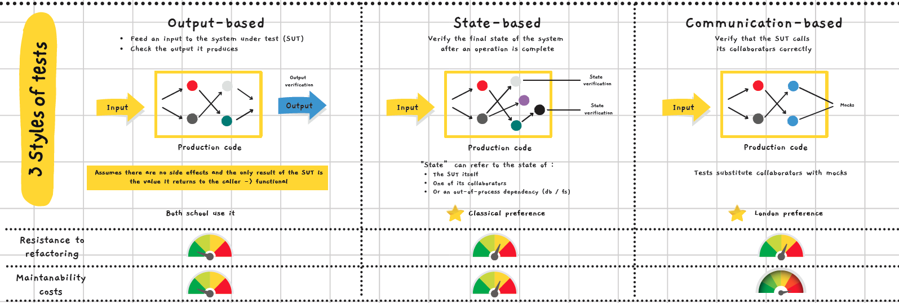

# Styles of Unit Tests
## Learning Goals
- Understand the 3 types of Unit Tests
- Have in mind the drawbacks of the different styles and how/why to migrate from one to another

## Connect - Style with styles
From the code snippets below, name which `Unit Test` style is used in each one :

```c#
// Snippet 1
[Fact]
public void Discount_Of_2_Products_Should_Be_2_Percent()
{
    var product1 = new Product("Kaamelott");
    var product2 = new Product("Free Guy");

    var discount = PriceEngine.CalculateDiscount(product1, product2);
    
    discount.Should().Be(0.02);
}

// Snippet 2
[Fact]
public void Greet_A_User_Should_Send_An_Email_To_It()
{
    const string email = "john.doe@email.com";
    var emailGatewayMock = new Mock<IEmailGateway>();
    var sut = new Controller(emailGatewayMock.Object);
    
    sut.GreetUser(email);

    emailGatewayMock.Verify(e => e.SendGreetingsEmail(email), Times.Once);
}

// Snippet 3
[Fact]
public void It_Should_Add_Given_Product_To_The_Order()
{
    var product = new Product("Free Guy");
    var sut = new Order();

    sut.Add(product);

    // Verify the state
    sut.Products.Should()
        .HaveCount(1)
        .And.Satisfy(item => item.Equals(product));
}
```

Code snippets and the associated production code are available in the `kata` folder -> Demo projects

## Concepts - Styles and costs


> Refactorings are harder with "Communication-based" : if you change the interaction you need to change the tests as well.

- Which kind of tests do mainly write?

## Concrete Practice - Refactor to output-based testing


## Conclusion

### Resources
Concepts are coming from Vladimir Khorikov's book : [Unit Testing Principles, Practices and Patterns](https://www.manning.com/books/unit-testing?gclid=CjwKCAjwvuGJBhB1EiwACU1AiXRex4_iJd4XNXoyWz_qGU_hCcov7JLwfgJUC7xZhzxQSSFLC2WRNhoCjMoQAvD_BwE)