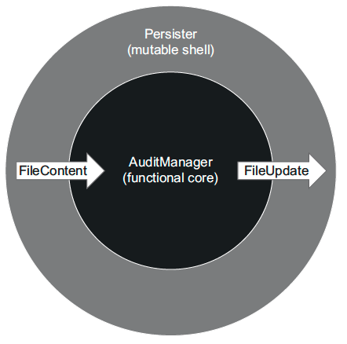

# Step by step



## AuditManager
- Start by deleting `IFileSystem` constructor injection and `_directoryName` from `AuditManager`
  - Let your `compiler` guide you
- Change method signature to match what we want to achieve
  - Generate the 2 new types from your IDE 

```c#
public FileUpdate AddRecord(
            FileContent[] files,
            string visitorName, 
            DateTime timeOfVisit)
```

- Adapt the `SortByIndex` method to return a list of `Tuple<int, FileContent>`

```c#
private static (int index, FileContent)[] SortByIndex(FileContent[] files)
    => files
        .AsEnumerable()
        .Select((content, index) => (index + 1, content))
        .ToArray();
```

- Create a new file if no files already by instantiating a `FileUpdate` with new record content inside

```c#
public FileUpdate AddRecord(
            FileContent[] files,
            string visitorName, 
            DateTime timeOfVisit)
{
    (int index, FileContent content)[] sorted = SortByIndex(files);
    var newRecord = visitorName + ';' + timeOfVisit.ToString("yyyy-MM-dd HH:mm:ss");;
    
    if (sorted.Length == 0)
    {
        return new FileUpdate("audit_1.txt", newRecord);
    }
    ...
}

public record FileUpdate(string FileName, string NewContent);
```

- Do the same for the next step -> `Append into existing file` :
```c#
 public FileUpdate AddRecord(
    FileContent[] files,
    string visitorName, 
    DateTime timeOfVisit)
{
    (int index, FileContent content)[] sorted = SortByIndex(files);
    var newRecord = visitorName + ';' + timeOfVisit.ToString("yyyy-MM-dd HH:mm:ss");;
    
    if (sorted.Length == 0)
    {
        return new FileUpdate("audit_1.txt", newRecord);
    }

    (int currentFileIndex, FileContent currentFile) = sorted.Last();
    List<string> lines = currentFile.Lines.ToList();

    if (lines.Count < _maxEntriesPerFile)
    {
        lines.Add(newRecord);
        string newContent = string.Join(Environment.NewLine, lines);
        return new FileUpdate(currentFile.FileName, newContent);
    }
    ...
}

// File content when existing
public record FileContent(string FileName, string[] Lines);
```

- Finish with the case where we need to create a new audit file
  - Think about removing everything related to folders

```c#
public FileUpdate AddRecord(
    FileContent[] files,
    string visitorName, 
    DateTime timeOfVisit)
{
    (int index, FileContent content)[] sorted = SortByIndex(files);
    var newRecord = visitorName + ';' + timeOfVisit.ToString("yyyy-MM-dd HH:mm:ss");;
    
    if (sorted.Length == 0)
    {
        return new FileUpdate("audit_1.txt", newRecord);
    }

    (int currentFileIndex, FileContent currentFile) = sorted.Last();
    List<string> lines = currentFile.Lines.ToList();

    if (lines.Count < _maxEntriesPerFile)
    {
        lines.Add(newRecord);
        string newContent = string.Join(Environment.NewLine, lines);
        return new FileUpdate(currentFile.FileName, newContent);
    }
    else
    {
        int newIndex = currentFileIndex + 1;
        string newName = $"audit_{newIndex}.txt";
        return new FileUpdate(newName, newRecord);
    }
}
```

- We have a first pure version of our `AuditManager`

```c#
namespace Audit
{
    public class AuditManager
    {
        private readonly int _maxEntriesPerFile;

        public AuditManager(int maxEntriesPerFile)
            => _maxEntriesPerFile = maxEntriesPerFile;

        public FileUpdate AddRecord(
            FileContent[] files,
            string visitorName, 
            DateTime timeOfVisit)
        {
            (int index, FileContent content)[] sorted = SortByIndex(files);
            var newRecord = visitorName + ';' + timeOfVisit.ToString("yyyy-MM-dd HH:mm:ss");
            
            if (sorted.Length == 0)
            {
                return new FileUpdate("audit_1.txt", newRecord);
            }
        
            (int currentFileIndex, FileContent currentFile) = sorted.Last();
            List<string> lines = currentFile.Lines.ToList();
        
            if (lines.Count < _maxEntriesPerFile)
            {
                lines.Add(newRecord);
                string newContent = string.Join(Environment.NewLine, lines);
                return new FileUpdate(currentFile.FileName, newContent);
            }
            else
            {
                int newIndex = currentFileIndex + 1;
                string newName = $"audit_{newIndex}.txt";
                return new FileUpdate(newName, newRecord);
            }
        }

        private static (int index, FileContent)[] SortByIndex(FileContent[] files)
            => files
                .AsEnumerable()
                .Select((content, index) => (index + 1, content))
                .ToArray();
    }

    public record FileUpdate(string FileName, string NewContent);

    public record FileContent(string FileName, string[] Lines);
} 
```

- Let's adapt our tests accordingly


- We have lost some features in the battle
  - Let's implement the `Persister` class 

## Persister (Mutable shell)
