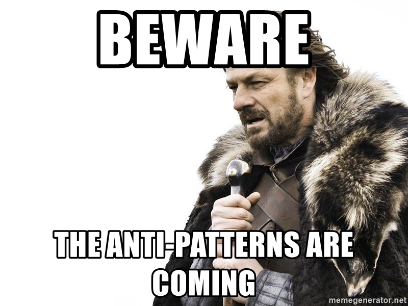
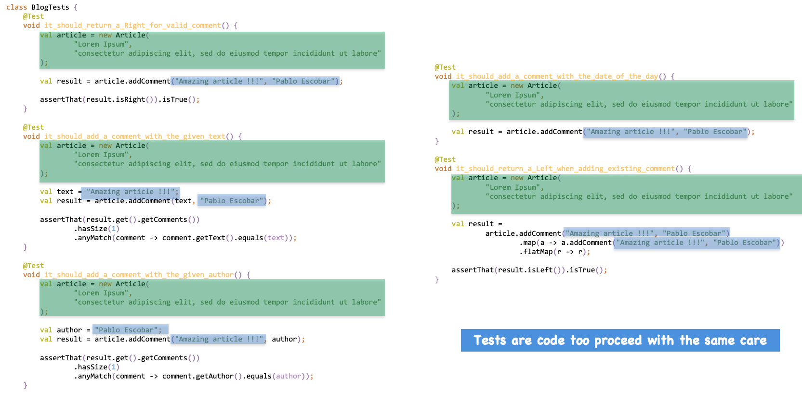
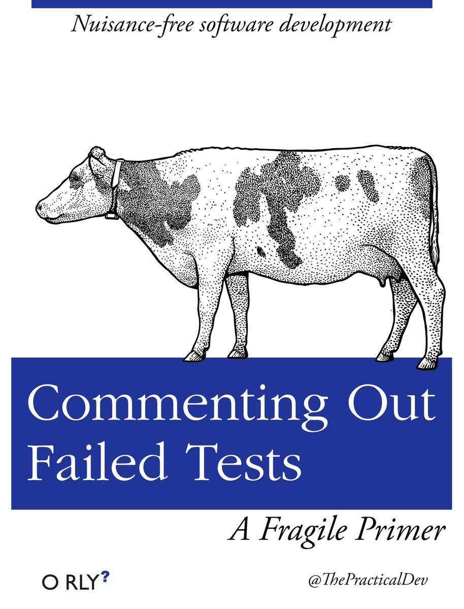

# Test anti-patterns
## Learning Goals
- Identify anti-patterns in tests
- Pay the same care to test code as to production code

## Connect - Anti-patterns? (10 min)


Open the `Anti-Patterns` solution and identify anti-patterns from the 3 test classes

## Concepts - Common anti-patterns (10 min)
### Leaking algorithm implementation in tests
```c#
public class PriceEngineTests
{
    [Fact]
    public void Discount_Of_3_Products_Should_Be_3_Percent()
    {
        var products = new List<Product> {new("P1"), new("P2"), new("P3")};
        var discount = PriceEngine.CalculateDiscount(products.ToArray());

        // We leak the algorithm implementation in tests
        // We have duplicated the calculation detail here
        discount.Should()
            .Be(products.Count * 0.01);
    }
}

public static class PriceEngine
{
    public static double CalculateDiscount(params Product[] products) 
        => Math.Min(products.Length * 0.01, 0.2);
}
```

> It is fine, to use "hardcoded" values in test. It is the expected result from our test case.

### Test external code/lib
```c#
public class TodoTests
{
    [Fact]
    public void It_Should_Search_On_Repository_With_The_Given_Text()
    {
        var todoRepositoryMock = new Mock<ITodoRepository>(Strict);
        var todoService = new TodoService(todoRepositoryMock.Object);

        var searchResults = new List<Todo>
        {
            new("Create miro", "add code samples in the board"),
            new("Add myths in miro", "add mythbusters from ppt in the board")
        };

        const string searchedText = "miro";

        todoRepositoryMock
            .Setup(repo => repo.Search(searchedText))
            .Returns(searchResults);

        // The S.U.T is a Test Double...
        var results = todoRepositoryMock.Object.Search(searchedText);

        // Assert that the call on our mock returns what we setup...
        // We test moq here
        results.Should().BeEquivalentTo(searchResults);
        todoRepositoryMock.Verify(repo => repo.Search(searchedText), Times.Once);
    }
}
```

> Never use a Mock as SUT. If not familiar : using AAA in comments can help

### Duplication everywhere


> Tests are code too proceed with the same care

### Only 1 assert per test
```c#
public class BlogTests
{
    [Fact]
    public void It_Should_Return_a_Right_For_Valid_Comment()
    {
        var article = new Article(
            "Lorem Ipsum",
            "consectetur adipiscing elit, sed do eiusmod tempor incididunt ut labore"
        );

        var result = article.AddComment("Amazing article !!!", "Pablo Escobar");

        result.IsRight.Should().BeTrue();
    }

    [Fact]
    public void It_Should_Add_A_Comment_With_The_Given_Text()
    {
        var article = new Article(
            "Lorem Ipsum",
            "consectetur adipiscing elit, sed do eiusmod tempor incididunt ut labore"
        );

        const string text = "Amazing article !!!";
        var result = article.AddComment(text, "Pablo Escobar");

        result.Should()
            .BeRight(right => right.Comments
                .Should()
                .HaveCount(1).And
                .Satisfy(comment => comment.Text == text)
            );
    }

    [Fact]
    public void It_Should_Add_A_Comment_With_The_Given_Author()
    {
        var article = new Article(
            "Lorem Ipsum",
            "consectetur adipiscing elit, sed do eiusmod tempor incididunt ut labore"
        );

        const string author = "Pablo Escobar";
        var result = article.AddComment("Amazing article !!!", author);

        result.Should()
            .BeRight(right => right.Comments
                .Should()
                .HaveCount(1).And
                .Satisfy(comment => comment.Author == author)
            );
    }

    [Fact]
    public void It_Should_Add_A_Comment_With_The_Date_Of_The_Day()
    {
        var article = new Article(
            "Lorem Ipsum",
            "consectetur adipiscing elit, sed do eiusmod tempor incididunt ut labore"
        );

        var result = article.AddComment("Amazing article !!!", "Pablo Escobar");
    }

    [Fact]
    public void It_Should_Add_A_Left_When_Adding_Existing_Comment()
    {
        var article = new Article(
            "Lorem Ipsum",
            "consectetur adipiscing elit, sed do eiusmod tempor incididunt ut labore"
        );

        var result = article.AddComment("Amazing article !!!", "Pablo Escobar")
            .Map(a => a.AddComment("Amazing article !!!", "Pablo Escobar"))
            .Flatten();

        result.IsLeft.Should().BeTrue();
    }
}
```
4 tests to maintain but here we check a single behavior : `add a comment in an article`

> Tests should be behavior oriented not data oriented

### Technical concepts in test names
```c#
[Fact]
// What is a Right from a business perspective
public void It_Should_Return_a_Right_For_Valid_Comment()
{
    var article = new Article(
        "Lorem Ipsum",
        "consectetur adipiscing elit, sed do eiusmod tempor incididunt ut labore"
    );

    var result = article.AddComment("Amazing article !!!", "Pablo Escobar");

    result.IsRight.Should().BeTrue();
}

[Fact]
// What is a Left from a business perspective
public void It_Should_Add_A_Left_When_Adding_Existing_Comment()
{
    var article = new Article(
        "Lorem Ipsum",
        "consectetur adipiscing elit, sed do eiusmod tempor incididunt ut labore"
    );

    var result = article.AddComment("Amazing article !!!", "Pablo Escobar")
        .Map(a => a.AddComment("Amazing article !!!", "Pablo Escobar"))
        .Flatten();

    result.IsLeft.Should().BeTrue();
}
```

### Ambiguous naming
```c#
[Fact]
// What is a Valid Comment?
public void It_Should_Return_a_Right_For_Valid_Comment()
{
    var article = new Article(
        "Lorem Ipsum",
        "consectetur adipiscing elit, sed do eiusmod tempor incididunt ut labore"
    );

    var result = article.AddComment("Amazing article !!!", "Pablo Escobar");

    result.IsRight.Should().BeTrue();
}
```

> Avoid ambiguous names by using more descriptive names

### Missing/shitty assertions
```c#
[Fact]
public void It_Should_Add_A_Comment_With_The_Date_Of_The_Day()
{
    var article = new Article(
        "Lorem Ipsum",
        "consectetur adipiscing elit, sed do eiusmod tempor incididunt ut labore"
    );

    var result = article.AddComment("Amazing article !!!", "Pablo Escobar");
}
```
Tests without or poor assertions do not provide any value 

> Seeing a test failing is as important as seeing it passing

### Comment out failing tests
The worst anti-pattern...



A test that fails is a feedback loop for us
Always apply these rules instead of commenting/disabling/deleting them:
- [ ] Has a regression been found by the test? 
  - Fix the code!
- [ ] Is one of the assumptions of the test no longer valid? 
  - Delete it!!
- [ ] Has the application really changed the functionality under test for a valid reason? 
  - Update the test!!

> Never comment out failing tests

## Concrete Practice - Refactor to useful / maintainable tests (35 min)
Refactor previous anti-patterns

## Conclusion
- Which anti-patterns have you already seen in your code base?
- How could we fight them?