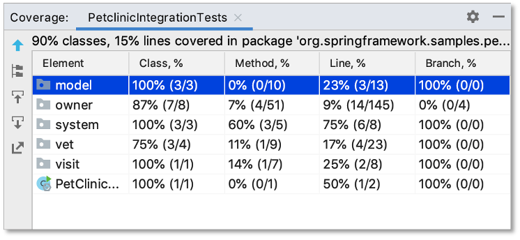
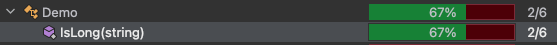
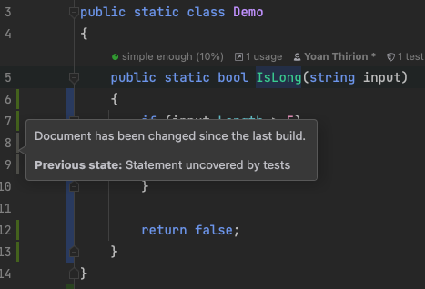
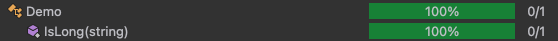
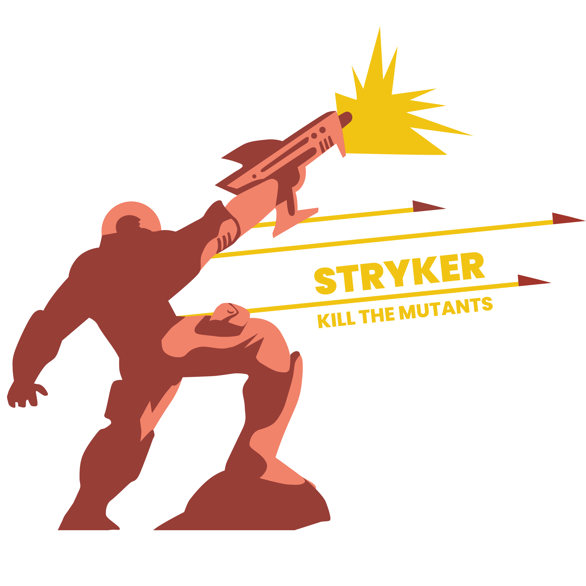

# The hunt to 100% code coverage
## Learning Goals
- Understand that 100% code coverage does NOT mean high test suite quality
- Understand what is mutation testing and how it can help us

## Connect - Test Quality
In pairs, discuss the question `How can we measure test quality?`

## Concepts - Code coverage
> A coverage metric showing how much source code a test suite executes, from none to 100%




Coverage metrics are a `good negative indicator` but a `bad positive one`:
- Too little coverage in your code base -> 10%
  - Demonstrates you are not testing enough
- The reverse isn’t true
  - Even 100% coverage isn’t a guarantee that you have a good-quality test suite (let's demonstrate it in a few seconds)

### Demo
- Imagine you have this simple production code:
```c#
public static bool IsLong(string input)
{
    if (input.Length > 5)
    {
        return true;
    }
    return false;
}
```
- And only one associated test:
```c#
public class DemoTests
{
    [Fact]
    public void Should_Return_False_For_Abc()
        => Demo.IsLong("abc").Should().BeFalse();
} 
```
- If you run your code coverage on it, what is the result?

- Why?
    - `Code coverage` = `Lines of executed code` - 4 / `Total number of lines` - 6



### What if we change our production code?
- Let's keep the same test but simplify our production code
```c#
public static bool IsLong(string input)
        => input.Length > 5; 
```
- If we run our test coverage again, we have a different result

- Why?
  - `Code coverage` = `Lines of executed code` - 1 / `Total number of lines` - 1
- Test still verifies the same number of possible outcomes…
- But we are now at **100% of code coverage**...

### Branch coverage
- Focuses on control structures : **if, switch, ... statements**
- Shows how many of such control structures are traversed by at least one test in the suite

- 2 branches in our production code : `Length > 5` && `Length < 5`
  - With this metric and the actual source code, we should obtain a coverage of `50%`

### The problem with coverage
- We can’t guarantee that the test verifies all the possible outcomes of the system under test 
- No coverage metric can consider code paths in external libraries
- Look at this test for example
  - We would still have 100% coverage
```c#
public class DemoTests
{
    [Fact]
    public void Should_Return_False_For_Abc()
        => Demo.IsLong("abc");
} 
```
- The test has no assertion but it has no impact on the coverage... 
  - Unit tests must have appropriate assertions of course

### Mutation testing
- Test our tests by introducing MUTANTS (fault) into our production code during the test execution:
  - To check that the test is failing 
  - If the test pass, there is an issue
- We can introduce mutants manually 
  - When working on legacy code for example 
  - When doing some TDD

Of course, there are automated tools


#### How it works?
- Step 1: Generate mutants

- Step 2: Kill them all
- Check that all your tests are green on the non-mutated business code
- Take the mutants one by one 
  - Place them in front of the wall of the shot 
  - Fire a salvo of unit tests
- Step 3: Make the assessment
  - Who survived? Who was killed?
  - If your tests fail then the mutant is killed
  - If your tests passed, the mutant survived

```gherkin
As a mutant code
When tests are launched
I am detected
So the code is correctly tested

As a mutant code
When tests are launched
I am NOT detected
So the code is NOT correctly tested
```

> The higher the percentage of mutants killed, the more effective your tests are.



- stryker supports `js` and friends, `C#` and `scala`
  - [Here](https://stryker-mutator.io/docs/stryker-net/mutations/) are the mutations available in C# for example
- Example of stryker report

[](https://dashboard.stryker-mutator.io/reports/github.com/stryker-mutator/robobar-example/master#mutant)
- `Killed`: At least one test failed while this mutant was active. 
  - The mutant is killed. This is what you want, good job!
- `Survived`: When all tests passed while this mutant was active, the mutant survived
- `Timeout`: The running of tests with this mutant active resulted in a timeout.
  - For example, the mutant resulted in an infinite loop in your code.
- `No coverage`: The mutant isn't covered by one of your tests and survived as a result.
- `Ignored`: The mutant wasn't tested because it is ignored. 
  - Not count against your mutation score but will show up in reports.

## Concrete Practice - Let's kill some mutants

## Conclusion

