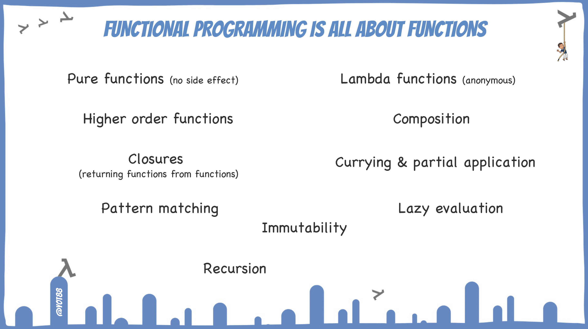
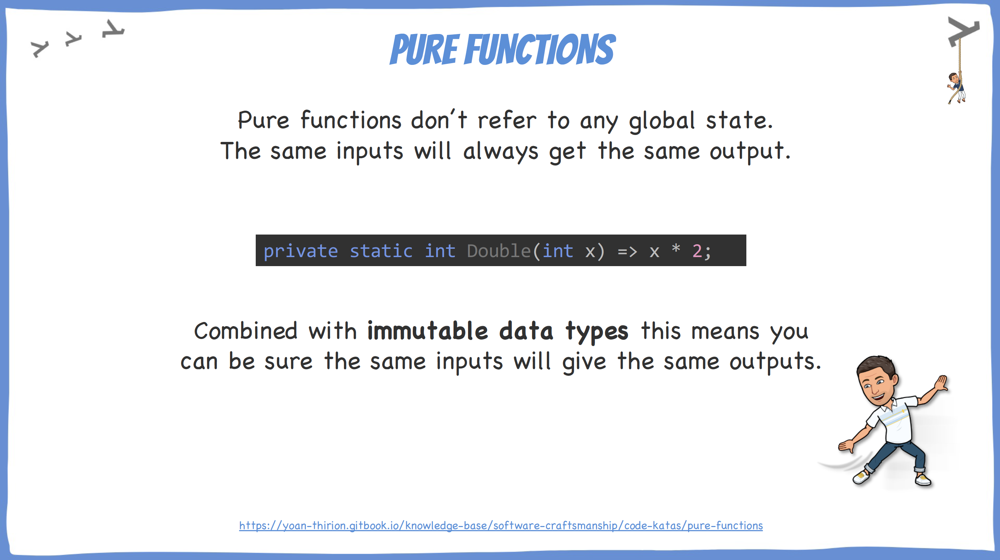
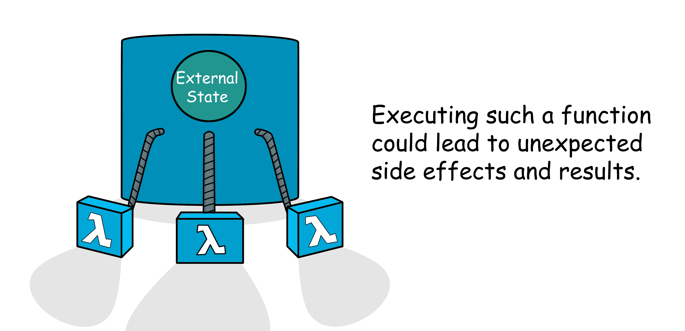
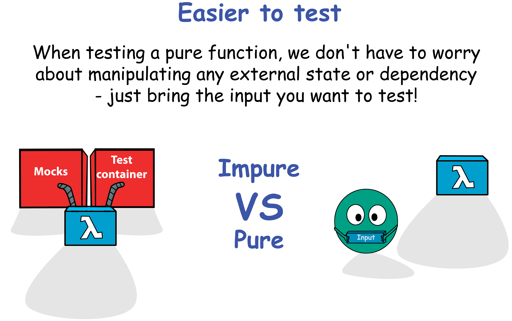

# Pure Functions

## Learning Goals

- Understand what are Pure Functions and the benefits of using them

## Connect - Categorization

Categorize these code samples in **Pure Functions** vs **Impure Functions** :

```python
import random

def f(x):
    if random.randint(1, 2) == 1:
        return x + 1
    return x + 2
```

```java
public class MathUtility {
    public static int sum(int num1, int num2) {
        return num1 + num2;
    }
}
```

```java
public class Line {
    private int value = 0;

    public int add(int nextValue) {
        this.value += nextValue;
        return this.value;
    }
}
```

```java
public class MathUtility {
    private static int count = 1;
    public static int sum(int num1, int num2) {
        count++;
        multiply(num1,num2);
        return num1 + bnum2;
    }
}
```

```c#
const double = x => x * 2;
```

## Concepts

### Functional Programming



### Pure Functions



#### Benefits

They are easier to **understand** and **test** because of these properties :

- You can see **all the input in the argument list**
- The execution is **deterministic** : the same input will always get the same output
- You can see **all the output in the return value**
    - Making it easier to understand / maintain

> Code that is hard to test will lack some or all of these properties.

There are other benefits than testing from writing only pure functions :

- `Parallelization` : without any shared state to worry about, we can easily parallelize calculations across multiple
  threads
- `Memoization` : since the same input always result in the same output we can cache the results of our function
- `Lazy evaluation` : we can delay function evaluation only when it's actually needed

### How to?

Take simple habits :

- Never mutate any input value from a function
- Never mutate the object in which the function is declared

> In both cases, prefer to return a new instance of the object you want to mutate

### Impure Functions



Impure functions often break
the [Command Query Separation (CQS) principle](https://martinfowler.com/bliki/CommandQuerySeparation.html) that says we
should divide our object methods into 2 separated categories :

- `Queries` : Return a result and do not change the observable state of the system (are free of side effects)
- `Commands` : Change the state of a system but do not return a value.

### Testing simplicity



## Concrete Practice - Refactor to Pure Function

- Identify the `impure function`
- Refactor it


Step-by-step solution available [here](step-by-step.md)

## Conclusion

- How much of the time do you find yourself writing tests for functions that have all the three properties of pure
  functions ?
- What do you need to write more Pure Functions ?