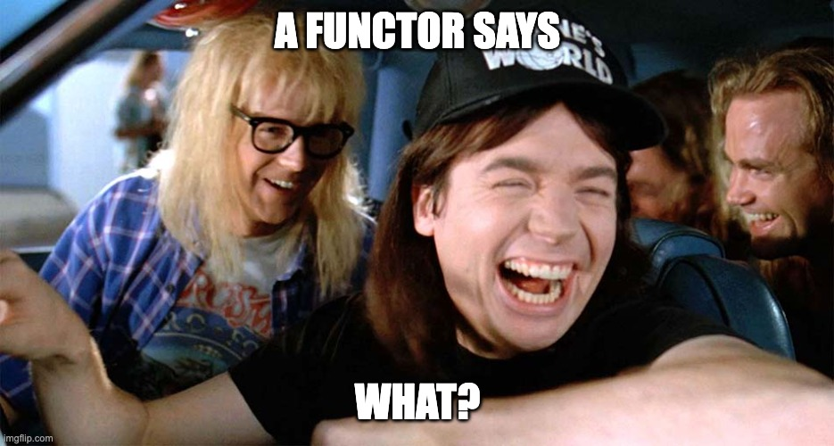
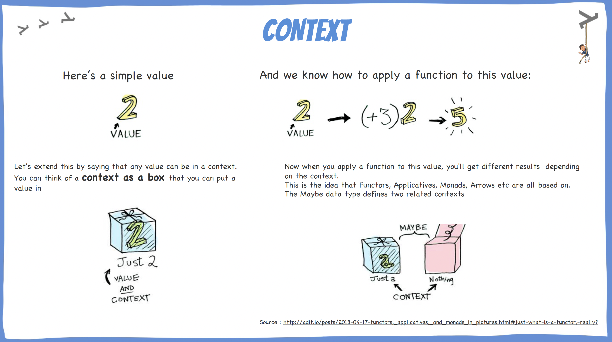
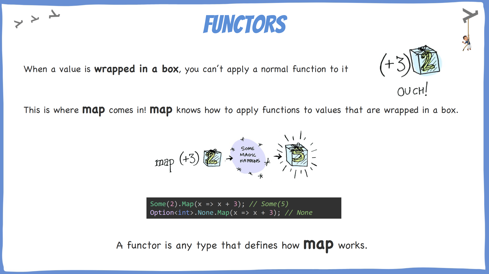
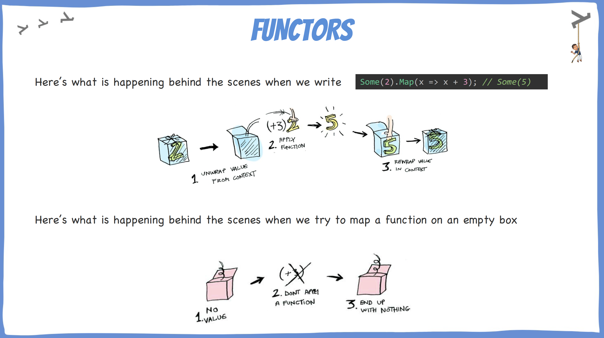
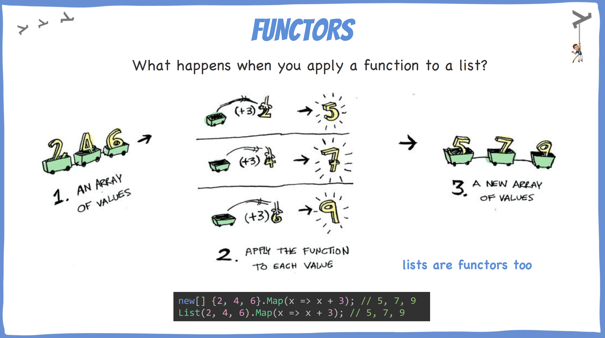
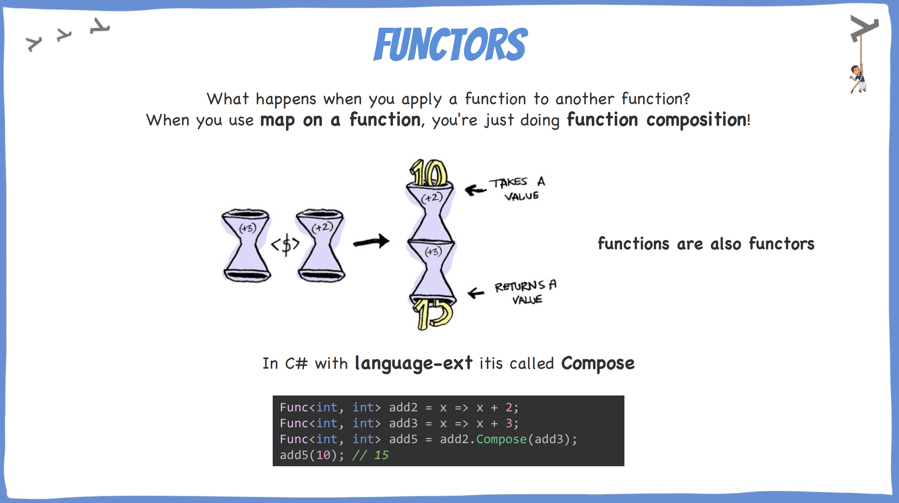
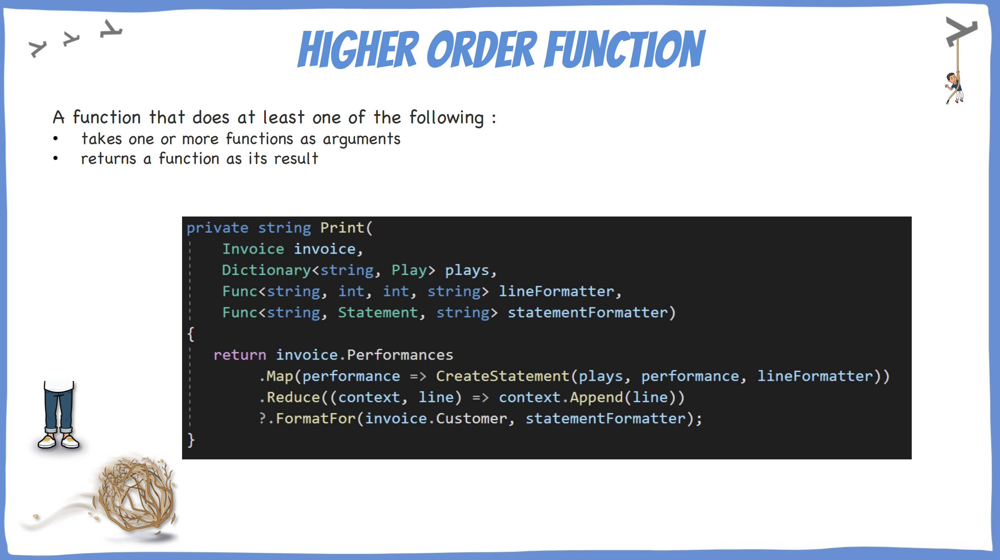
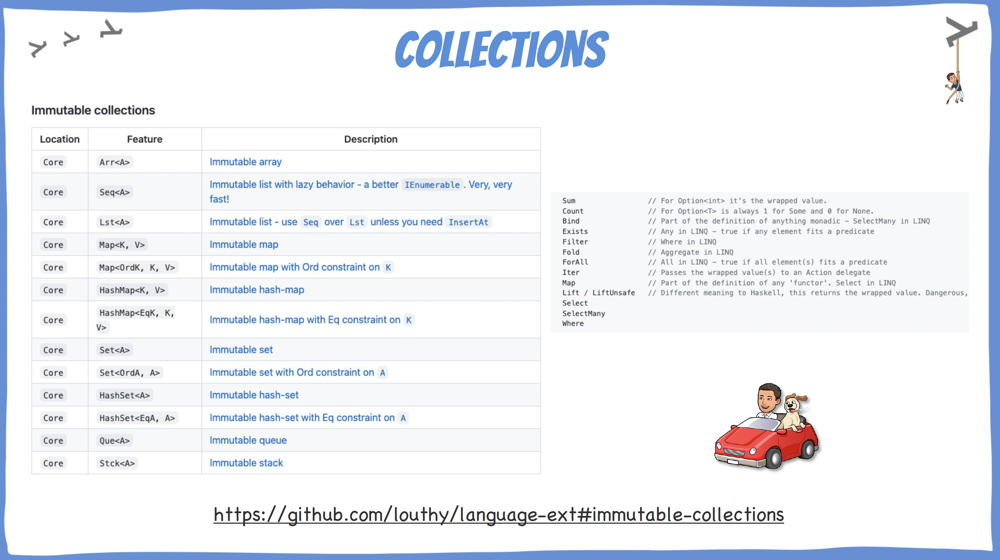

# Functors

## Learning Goals

- Understand what are functors
- Discover a new library called `Language-Ext`

## Connect - Functor?

Pick only the correct items:

- [ ] A functor is a type of function
- [ ] A functor is a mapping between categories
- [ ] A functor is any type that defines how map works
- [ ] A functor is a fun constructor
- [ ] The term functor comes from graph theory

### Correction

- [ ] A functor is a type of function
- [X] A functor is a mapping between categories
- [X] A functor is any type that defines how map works
- [ ] A functor is a fun constructor
- [ ] The term functor comes from graph theory -> from `category` theory

## Concepts

## Concrete Practice - Fun with Functors

Do the exercises in the following order:

- `FunctionsAreFunctors`
- Then do the same exercise with `Language-Ext`
- Finish with the exercises in `ListsAreFunctors`

Step-by-step solution available [here](step-by-step.md)

## Conclusion

Think about what we did today. If you had to explain the main idea of the topic to someone else, what would you say?

## Resources

- [Language-Ext collections](https://github.com/louthy/language-ext#immutable-collections)
- [Functors, Applicatives, And Monads In Pictures](https://adit.io/posts/2013-04-17-functors,_applicatives,_and_monads_in_pictures.html#just-what-is-a-functor,-really?)