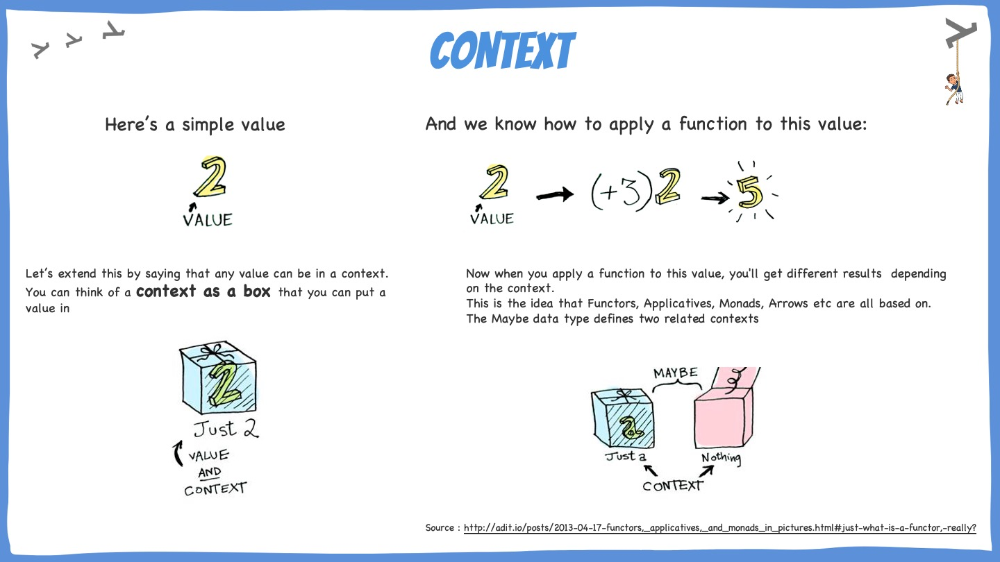
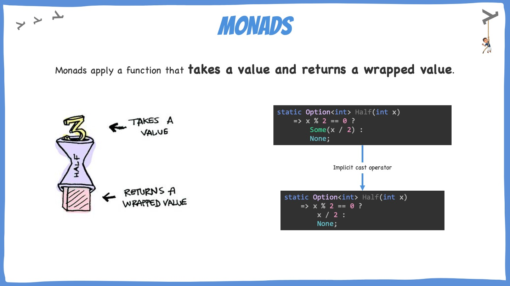
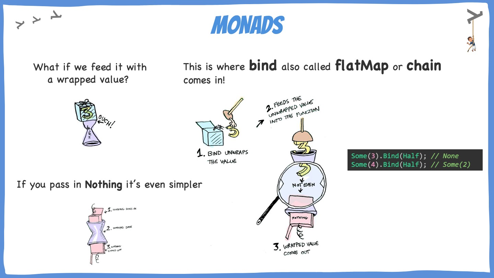
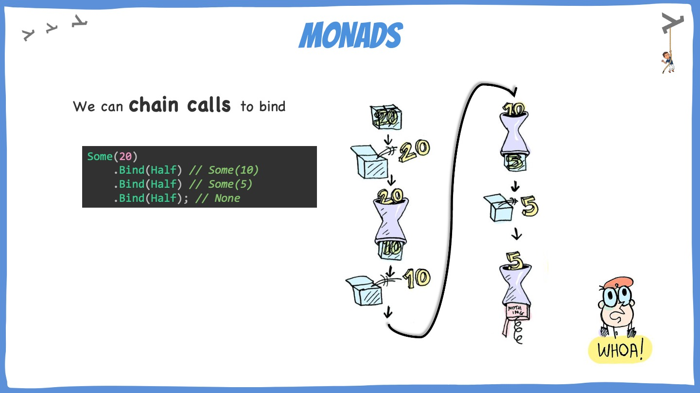
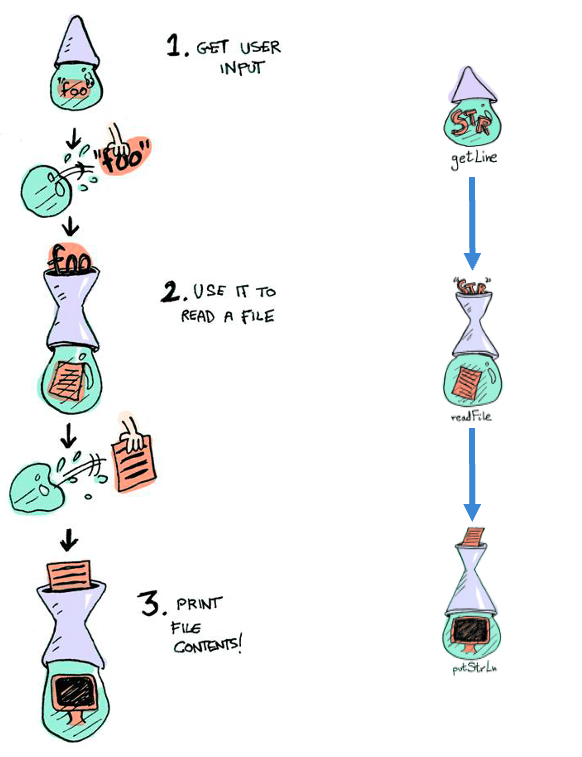

# Monads

## Learning Goals

- Understand what are monads
- Discover how it can help you create more expressive code (code that contains no lie)

## Connect - Liar liar

Identify lies in those code snippets:

```c#
public static Seq<Person> Filter(
    this Seq<Person> persons,
    Func<Person, bool> predicate)
    => persons.IsEmpty
        ? throw new ArgumentException("Can not filter an empty collection")
        : persons.Filter(predicate);
```

```c#
class CreatePersonUseCase
{
    public CreatePersonResponse Handle(CreatePersonCommand command)
    {
        if (string.IsNullOrWhiteSpace(command.FirstName))
        {
            throw new ArgumentException("First Name can not be empty");
        }

        if (string.IsNullOrWhiteSpace(command.LastName))
        {
            throw new ArgumentException("Last Name can not be empty");
        }

        return new CreatePersonResponse();
    }
}
```


### Correction

Those snippets code contain `lies`, if you take a look at the public API level:

- Filter method: `Seq<Person>` -> `Func<Person, bool>` -> `Seq<Person>`
- Handle method: `CreatePersonCommand` -> `CreatePersonResponse`

Those methods can throw exceptions and are not explicit on it.
Sometimes it can fail but this failure is not visible from the outside.

> It is an example of poor encapsulation and lack of transparency

To fix this issue we have a couple of options:

- Constrain the inputs (with only valid inputs)
- Extend the output to represent the failure possibility

## Concepts




### Monadic Binding




### Monads by example



```c#
private static Try<string> GetUserInput()
{
    WriteLine("File :");
    // Explicitly use a Try
    return Try(ReadLine)!;
}

private static Try<string> ReadFile(string filePath)
    // Or use implicit cast
    => () => File.ReadAllText(filePath);
    
public static void Process() =>
    GetUserInput()
        .Bind(ReadFile)
        // Forced to handle both cases: Success and Failure
        .Match(WriteLine,
            ex => WriteLine($"FAILURE : {ex.StackTrace}")
        );
```

### Language-Ext monads

[](https://github.com/louthy/language-ext#optional-and-alternative-value-monads)

## Concrete Practice - Monads by Example

**Important**: to use monads and a lot of `language-ext` feature there is 1 `using` to rule them all

```c#
using static LanguageExt.Prelude;
```

### Option

Many functional languages disallow null values, as null-references can introduce hard to find bugs.
**Option is a type safe alternative** to null values.

> Avoid nulls and NPE by using Options

An Option<T> can be in one of two states :

- `Some` => the presence of a value
- `None` => lack of a value

#### Important functions

- `Map`: We can match down to a primitive type, or can stay in the elevated types and do logic using map.
    - lambda inside map will **not be** invoked if `Option` is in `None` state
    - Option is a **replacement for if statements** ie if obj == null
    - Working in elevated context to do logic

```c#
var aValue = Some(2);
aValue.Map(x => x + 2); // Some(5)

var none = Option<int>.None;
none.Map(x => x + 2); // None
```

- `Match`: match down to primitive type

```c#
aValue.Match(x => x + 3, () => 0); // 5
none.Match(x => x + 3, () => 0); // 0
```

- `IfNone`: like a `GetOrElse` method

```c#
var value = aValue.IfNone(1); // 2
var noneValue = none.IfNone(42); // 42
```

> Do the OptionExercises

### Try

Try is a monadic container which represents a computation that `may either throw an exception or successfully completes`
.

```c#
var random = new Random();
var robots = new[] {"Tars", "Kipp", "Case"};

Try<string> RandomRobot() =>
    () => random.Next(10) > 5
        ? throw new InvalidProgramException("Plenty of slaves for my robot colony")
        : robots[random.Next(3)];

RandomRobot().Map(_ => _.ToUpperInvariant()); // Failure -> InvalidProgramException : "Plenty of slaves for my robot colony"
RandomRobot().Map(_ => _.ToUpperInvariant()); // "KIPP"
RandomRobot().Map(_ => _.ToUpperInvariant()); // "CASE"
RandomRobot().Map(_ => _.ToUpperInvariant()); // Failure -> InvalidProgramException : "Plenty of slaves for my robot colony"
```

> Do the TryExercises

Step-by-step solution available [here](step-by-step.md)

## Conclusion

Think about what we did today. If you had to explain the main idea of the topic to someone else, what would you say?