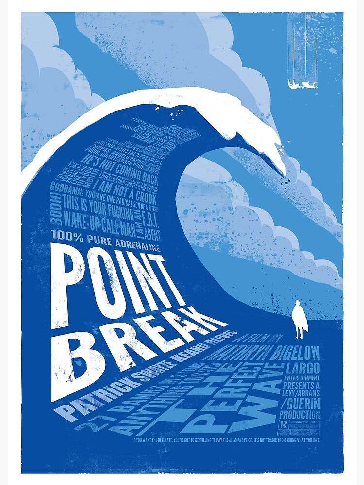

# Monads (2/2)

## Learning Goals

- Discover other monads than `Option

## Connect - Limits

What is the limit of this code snippet?

```c#
public record Account(string Number, decimal Balance)
{
    public Option<Account> WithDraw(decimal amount)
        => amount >= Balance
            ? None
            : this with {Balance = Balance - amount};
}
```



### Correction

- In terms of signature this method is pretty transparent: `decimal` -> `Option<Account>`
    - It says explicitly that the operation could fail
    - But does not explain why it could fail -> `None` only
- Sometimes in our business system we need to make more sense of this kind of code
    - To apply recover logic for example

## Concepts

### Try

Try is a monadic container which represents a computation that `may either throw an exception or successfully completes`
.

```c#
var random = new Random();
var robots = new[] {"Tars", "Kipp", "Case"};

Try<string> RandomRobot() =>
    () => random.Next(10) > 5
        ? throw new InvalidProgramException("Plenty of slaves for my robot colony")
        : robots[random.Next(3)];

RandomRobot().Map(_ => _.ToUpperInvariant()); // Failure -> InvalidProgramException : "Plenty of slaves for my robot colony"
RandomRobot().Map(_ => _.ToUpperInvariant()); // "KIPP"
RandomRobot().Map(_ => _.ToUpperInvariant()); // "CASE"
RandomRobot().Map(_ => _.ToUpperInvariant()); // Failure -> InvalidProgramException : "Plenty of slaves for my robot colony"
```

### Either

`Either` Holds one of two values 'Left' or 'Right’.

- `Left` is considered `wrong` or `in error`
- `Right` is right

When the `Either` is in a `Left` state, it cancels computations like bind or map, etc.

```c#
public record Account(string Number, decimal Balance)
{
    public Either<Error, Account> WithDraw(decimal amount)
        => amount >= Balance
            ? Error.New("Insufficient Balance")
            : this with {Balance = Balance - amount};
}

new Account("Account1", 900).WithDraw(1000); // Left("Insufficient Balance")
new Account("Account2", 900).WithDraw(100); // Right(Account { Balance = 800 })
```

`Error` is a useful `struct` available through `Language-Ext`.

## Concrete Practice

- Do the `TryExercises`
- Then the `EitherExercises`

Step-by-step solution available [here](step-by-step.md)

## Conclusion - When?

Think about when to use it.
List some usages.

Usually we use `Try` only when we run unpredictable code like:

- calling an API
- storing data in a database
- sending an email
- ...

We prefer using `Either` or a `Result` for every error we have under management in our business process
