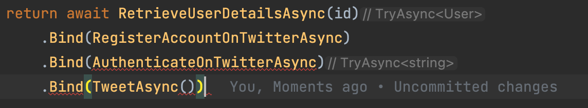
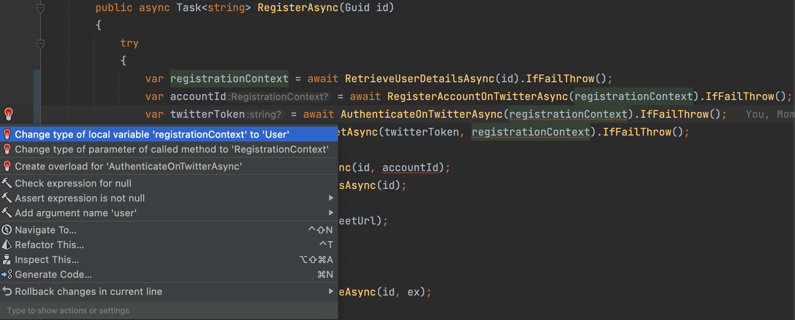
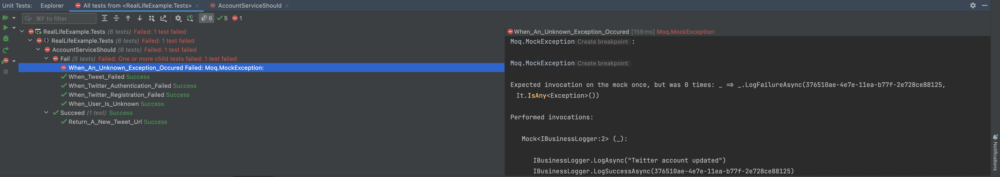

# Real Life Example

### Understand what is implemented

By checking the code we can understand this logic :

```text
1. Given an id
2. Retrieve a user details: email, first name and password (not really secured ;-)
3. Register an account on Twitter
4. Authenticate on Twitter
5. Tweet *Hello I am ...*
6. Update the user details with the Twitter account id
7. Log something in case of success
8. Return the tweet URL
9. In case of error anywhere log something also
```

This code is easy to follow but has a lot of repetitions (check null values -> throw Exception)

### Define the pipeline

```C#
// Given an id 
await _userService.FindByIdAsync(id) // Retrieve a user details
  > await _twitterService.RegisterAsync(user.Email, user.Name) // Register an account on Twitter
  > await _twitterService.AuthenticateAsync(user.Email, user.Password) // Authenticate on Twitter
  > await _twitterService.TweetAsync(twitterToken, "Hello I am " + user.Name) // Tweet *Hello I am ...*
  > await UpdateTwitterAccountIdAsync(id, accountId) // Update the user details with the Twitter account id
  > await _businessLogger.LogSuccessAsync(id) // Log something in case of success
  > await _businessLogger.LogFailureAsync(id, ex) // In case of error anywhere log it
  > tweetUrl // Return the tweet URL or throw an exception
```

## How to ?

* We want to avoid a lot of null checks so we could use `OptionAsync` or `TryAsync`

* Here we will use `Try` monad because our business logic is already inside a `try/catch` block
    * We will chain calls through it

This is a step by step guide with a "*naive*" approach :

* Don't anticipate and introduce concepts before we need it
* At everytime the test will compile and tests are green

### 1) Extract "Retrieve a user details" method

:large_blue_circle: Extract `_userRepository.FindByIdAsync(id)` into a function returning a `TryAsync`

```C#
public async Task<string> RegisterAsync(Guid id)
{
    try
    {
        var user = await RetrieveUserDetailsAsync(id).IfFailThrow();

        var accountId = await _twitterService.RegisterAsync(user.Email, user.Name);

        if (accountId == null)
        {
            throw new TwitterRegistrationFailedException(user);
        }

        var twitterToken = await _twitterService.AuthenticateAsync(user.Email, user.Password);

        if (twitterToken == null)
        {
            throw new TwitterAuthenticationFailedException(user);
        }

        var tweetUrl = await _twitterService.TweetAsync(twitterToken, "Hello I am " + user.Name);

        if (tweetUrl == null)
        {
            throw new TweetFailedException(twitterToken);
        }

        await UpdateTwitterAccountIdAsync(id, accountId);
        await _businessLogger.LogSuccessAsync(id);

        return await Task.FromResult(tweetUrl);
    }
    catch (Exception ex)
    {
        await _businessLogger.LogFailureAsync(id, ex);
        throw;
    }
}

private TryAsync<User> RetrieveUserDetailsAsync(Guid id)
    => TryAsync(() => _userRepository.FindByIdAsync(id))
        .Map(user =>
        {
            if (user == null)
                throw new UnknownUserException(id);
            return user;
        });
```

### 2) Extract "Register an account on Twitter" method

:large_blue_circle: Continue extraction

```C#
public async Task<string> RegisterAsync(Guid id)
{
    try
    {
        var user = await RetrieveUserDetailsAsync(id).IfFailThrow();
        var accountId = await RegisterAccountOnTwitterAsync(user).IfFailThrow();

        var twitterToken = await _twitterService.AuthenticateAsync(user.Email, user.Password);

        if (twitterToken == null)
        {
            throw new TwitterAuthenticationFailedException(user);
        }

        var tweetUrl = await _twitterService.TweetAsync(twitterToken, "Hello I am " + user.Name);

        if (tweetUrl == null)
        {
            throw new TweetFailedException(twitterToken);
        }

        await UpdateTwitterAccountIdAsync(id, accountId);
        await _businessLogger.LogSuccessAsync(id);

        return await Task.FromResult(tweetUrl);
    }
    catch (Exception ex)
    {
        await _businessLogger.LogFailureAsync(id, ex);
        throw;
    }
}

private TryAsync<User> RetrieveUserDetailsAsync(Guid id)
    => TryAsync(() => _userRepository.FindByIdAsync(id))
        .Map(user =>
        {
            if (user == null)
                throw new UnknownUserException(id);
            return user;
        });

private TryAsync<string> RegisterAccountOnTwitterAsync(User user)
    => TryAsync(() => _twitterService.RegisterAsync(user.Email, user.Name))
        .Map(accountId =>
        {
            if (accountId == null)
                throw new TwitterRegistrationFailedException(user);
            return accountId;
        });

private async Task UpdateTwitterAccountIdAsync(Guid id, string twitterAccountId)
    => await _businessLogger.LogAsync("Twitter account updated");
```

### 3) A few methods later

:large_blue_circle: Later...

```c#
public class AccountService
{
    private readonly IBusinessLogger _businessLogger;
    private readonly IUserRepository _userRepository;
    private readonly ITwitterService _twitterService;

    public AccountService(
        IUserRepository userRepository,
        ITwitterService twitterService,
        IBusinessLogger businessLogger)
    {
        _userRepository = userRepository;
        _twitterService = twitterService;
        _businessLogger = businessLogger;
    }

    public async Task<string> RegisterAsync(Guid id)
    {
        try
        {
            var user = await RetrieveUserDetailsAsync(id).IfFailThrow();
            var accountId = await RegisterAccountOnTwitterAsync(user).IfFailThrow();
            var twitterToken = await AuthenticateOnTwitterAsync(user).IfFailThrow();
            var tweetUrl = await TweetAsync(twitterToken, user).IfFailThrow();

            await UpdateTwitterAccountIdAsync(id, accountId);
            await _businessLogger.LogSuccessAsync(id);

            return await Task.FromResult(tweetUrl);
        }
        catch (Exception ex)
        {
            await _businessLogger.LogFailureAsync(id, ex);
            throw;
        }
    }

    private TryAsync<User> RetrieveUserDetailsAsync(Guid id)
        => TryAsync(() => _userRepository.FindByIdAsync(id))
            .Map(user =>
            {
                if (user == null)
                    throw new UnknownUserException(id);
                return user;
            });

    private TryAsync<string> RegisterAccountOnTwitterAsync(User user)
        => TryAsync(() => _twitterService.RegisterAsync(user.Email, user.Name))
            .Map(accountId =>
            {
                if (accountId == null)
                    throw new TwitterRegistrationFailedException(user);
                return accountId;
            });

    private TryAsync<string> AuthenticateOnTwitterAsync(User user)
        => TryAsync(() => _twitterService.AuthenticateAsync(user.Email, user.Password))
            .Map(twitterToken =>
            {
                if (twitterToken == null)
                    throw new TwitterAuthenticationFailedException(user);
                return twitterToken;
            });

    private TryAsync<string> TweetAsync(string twitterToken, User user)
        => TryAsync(() => _twitterService.TweetAsync(twitterToken, "Hello I am " + user.Name))
            .Map(tweetUrl =>
            {
                if (tweetUrl == null)
                    throw new TweetFailedException(twitterToken);
                return tweetUrl;
            });

    private async Task UpdateTwitterAccountIdAsync(Guid id, string twitterAccountId)
        => await _businessLogger.LogAsync("Twitter account updated");
}
```

### 4) Pipeline ?

*Where is the pipeline ? You sold me a pipeline... all I see is IfFailThrow and no gain in it*

Indeed, so our next step is to put all together : you may have already seen the problem

> Take a look at the method signatures : we are not working on the same kind of data

If we chain our calls we will have something like this :  


#### What is the solution ?

Use a `Context` object that will help to chain calls

```C#
private Try<Context> DoSomething(Context context)
```

- Create a Context class that will serve as a container of the needed data in the pipeline
- We can use a `record` to avoid having to write boilerplate code

```C#
public record RegistrationContext(
    Guid Id,
    string Email,
    string Name,
    string Password,
    string AccountId = "",
    string Token = "",
    string Url = ""
);
```

- Then chain the calls by changing method signatures :
    - We want methods with this signature: `RegistrationContext` -> `TryAsync<RegistrationContext>`
- Use your IDE to assist you



- The code will look like this:

```C#
public class AccountService
{
    private readonly IBusinessLogger _businessLogger;
    private readonly IUserRepository _userRepository;
    private readonly ITwitterService _twitterService;

    public AccountService(
        IUserRepository userRepository,
        ITwitterService twitterService,
        IBusinessLogger businessLogger)
    {
        _userRepository = userRepository;
        _twitterService = twitterService;
        _businessLogger = businessLogger;
    }

    public async Task<string> RegisterAsync(Guid id)
    {
        try
        {
            var registrationContext = await RetrieveUserDetailsAsync(id).IfFailThrow();
            registrationContext = await RegisterAccountOnTwitterAsync(registrationContext).IfFailThrow();
            registrationContext = await AuthenticateOnTwitterAsync(registrationContext).IfFailThrow();
            registrationContext = await TweetAsync(registrationContext).IfFailThrow();

            await UpdateTwitterAccountIdAsync(id, registrationContext.AccountId).IfFailThrow();
            await _businessLogger.LogSuccessAsync(id);

            return await Task.FromResult(registrationContext.Url);
        }
        catch (Exception ex)
        {
            await _businessLogger.LogFailureAsync(id, ex);
            throw;
        }
    }

    private TryAsync<RegistrationContext> RetrieveUserDetailsAsync(Guid id)
        => TryAsync(() => _userRepository.FindByIdAsync(id))
            .Map(user =>
            {
                if (user == null)
                    throw new UnknownUserException(id);
                return user;
            })
            .Map(user => new RegistrationContext(user.Id, user.Email, user.Name, user.Password));

    private TryAsync<RegistrationContext> RegisterAccountOnTwitterAsync(RegistrationContext context)
        => TryAsync(() => _twitterService.RegisterAsync(context.Email, context.Name))
            .Map(accountId =>
            {
                if (accountId == null)
                    throw new TwitterRegistrationFailedException(context.Email);
                return context with {AccountId = accountId};
            });

    private TryAsync<RegistrationContext> AuthenticateOnTwitterAsync(RegistrationContext context)
        => TryAsync(() => _twitterService.AuthenticateAsync(context.Email, context.Password))
            .Map(twitterToken =>
            {
                if (twitterToken == null)
                    throw new TwitterAuthenticationFailedException(context.Email);
                return context with {Token = twitterToken};
            });

    private TryAsync<RegistrationContext> TweetAsync(RegistrationContext context)
        => TryAsync(() => _twitterService.TweetAsync(context.Token, "Hello I am " + context.Name))
            .Map(tweetUrl =>
            {
                if (tweetUrl == null)
                    throw new TweetFailedException(context.Token);
                return context with {Url = tweetUrl};
            });

    private async Task UpdateTwitterAccountIdAsync()
        => await _businessLogger.LogAsync("Twitter account updated");
}
```

Then we can build our pipeline

```C#
public Task<string> RegisterAsync(Guid id) =>
    RetrieveUserDetailsAsync(id)
        .Bind(RegisterAccountOnTwitterAsync)
        .Bind(AuthenticateOnTwitterAsync)
        .Bind(TweetAsync)
        .Bind(UpdateTwitterAccountIdAsync)
        .Bind(LogSuccessAsync)
        .Map(context => context.Url)
        .IfFailThrow();
```

For now the code looks like this

```C#
public class AccountService
{
    private readonly IBusinessLogger _businessLogger;
    private readonly IUserRepository _userRepository;
    private readonly ITwitterService _twitterService;

    public AccountService(
        IUserRepository userRepository,
        ITwitterService twitterService,
        IBusinessLogger businessLogger)
    {
        _userRepository = userRepository;
        _twitterService = twitterService;
        _businessLogger = businessLogger;
    }

    public Task<string> RegisterAsync(Guid id) =>
        RetrieveUserDetailsAsync(id)
            .Bind(RegisterAccountOnTwitterAsync)
            .Bind(AuthenticateOnTwitterAsync)
            .Bind(TweetAsync)
            .Bind(UpdateTwitterAccountIdAsync)
            .Bind(LogSuccessAsync)
            .Map(context => context.Url)
            .IfFailThrow();

    private TryAsync<RegistrationContext> RetrieveUserDetailsAsync(Guid id)
        => TryAsync(() => _userRepository.FindByIdAsync(id))
            .Map(user =>
            {
                if (user == null)
                    throw new UnknownUserException(id);
                return user;
            })
            .Map(user => new RegistrationContext(user.Id, user.Email, user.Name, user.Password));

    private TryAsync<RegistrationContext> RegisterAccountOnTwitterAsync(RegistrationContext context)
        => TryAsync(() => _twitterService.RegisterAsync(context.Email, context.Name))
            .Map(accountId =>
            {
                if (accountId == null)
                    throw new TwitterRegistrationFailedException(context.Email);
                return context with {AccountId = accountId};
            });

    private TryAsync<RegistrationContext> AuthenticateOnTwitterAsync(RegistrationContext context)
        => TryAsync(() => _twitterService.AuthenticateAsync(context.Email, context.Password))
            .Map(twitterToken =>
            {
                if (twitterToken == null)
                    throw new TwitterAuthenticationFailedException(context.Email);
                return context with {Token = twitterToken};
            });

    private TryAsync<RegistrationContext> TweetAsync(RegistrationContext context)
        => TryAsync(() => _twitterService.TweetAsync(context.Token, "Hello I am " + context.Name))
            .Map(tweetUrl =>
            {
                if (tweetUrl == null)
                    throw new TweetFailedException(context.Token);
                return context with {Url = tweetUrl};
            });

    private TryAsync<RegistrationContext> UpdateTwitterAccountIdAsync(RegistrationContext context)
        => TryAsync(_businessLogger.LogAsync("Twitter account updated"))
            .Map(_ => context);

    private TryAsync<RegistrationContext> LogSuccessAsync(RegistrationContext context)
        => TryAsync(_businessLogger.LogSuccessAsync(context.Id))
            .Map(_ => context);
}
```

:red_circle: We have introduced a regression regarding logging in case of failure that has been detected by our test
suite



We need to log through the `BusinessLogger`

- We can create an extension method on `TryAsync<T>`
- It can look like this
    - We need to make a temporary code like this
    - We pass by an `Either` to be able to log the exception only if there is a failure
    - We don't want to force an `await` of the `TryAsync`, it is not the decision of this method to do it

```c#
public static TryAsync<A> DoOnFailure<A>(this TryAsync<A> tryAsync, Action<Exception> action)
{
    tryAsync.ToEither()
        .Swap()
        .Do(error => action(error.ToException()));

    return tryAsync;
}
```

:green_circle: Our pipeline looks like this now

```c#
public Task<string> RegisterAsync(Guid id) =>
    RetrieveUserDetailsAsync(id)
        .Bind(RegisterAccountOnTwitterAsync)
        .Bind(AuthenticateOnTwitterAsync)
        .Bind(TweetAsync)
        .Bind(UpdateTwitterAccountIdAsync)
        .Bind(LogSuccessAsync)
        .Map(context => context.Url)
        .DoOnFailure(async failure => await _businessLogger.LogFailureAsync(id, failure))
        .IfFailThrow();
```

### 5) Refactoring?

We still have a lot of improvement areas in the code right now:

- We should explicitly state that the `RegisterAsync` method can fail by returning the `TryAsync`
- The business exceptions can be avoided by using the notion of `Error`
    - Let's keep `Exception` mechanism only for exceptional situations (no database access for example)
    - For now, it is the `AccountService` that throws the exception
        - It would make more sense if the collaborators clearly state that they can fail

#### Return `TryAsync`

:red_circle: We adapt the method and the test don't compile anymore

```c#
public TryAsync<string> RegisterAsync(Guid id) =>
    RetrieveUserDetailsAsync(id)
        .Bind(RegisterAccountOnTwitterAsync)
        .Bind(AuthenticateOnTwitterAsync)
        .Bind(TweetAsync)
        .Bind(UpdateTwitterAccountIdAsync)
        .Bind(LogSuccessAsync)
        .Map(context => context.Url)
        .DoOnFailure(async failure => await _businessLogger.LogFailureAsync(id, failure));
```

:green_circle: Adapt the tests

```c#
private async Task AssertFailureAsync<TException>(Guid userId, string expectedErrorMessage)
    where TException : Exception =>
    (await _accountService.RegisterAsync(userId))
    .Match(success => success.Should().BeNull("Because it should fail..."),
        failure => failure
            .Should()
            .BeOfType<TException>()
            .Which.Message
            .Should()
            .Be(expectedErrorMessage));
```

#### Collaborators return `EitherAsync`

:red_circle: Let's start with our first collaborator in our pipeline: `IUserRepository`

```c#
public interface IUserRepository
{
    EitherAsync<Error, User> FindByIdAsync(Guid id);
}

// We can simplify our code like this
private EitherAsync<Error, RegistrationContext> RetrieveUserDetailsAsync(Guid id)
    => _userRepository.FindByIdAsync(id)
        .Map(user => new RegistrationContext(user.Id, user.Email, user.Name, user.Password));
```

It will be easier if our pipeline uses only `EitherAsync` container

For now we use `ToEither` extension on `TryAsync`

```c#
public class AccountService
{
    private readonly IBusinessLogger _businessLogger;
    private readonly IUserRepository _userRepository;
    private readonly ITwitterService _twitterService;

    public AccountService(
        IUserRepository userRepository,
        ITwitterService twitterService,
        IBusinessLogger businessLogger)
    {
        _userRepository = userRepository;
        _twitterService = twitterService;
        _businessLogger = businessLogger;
    }

    public EitherAsync<Error, string> RegisterAsync(Guid id) =>
        RetrieveUserDetailsAsync(id)
            .Bind(RegisterAccountOnTwitterAsync)
            .Bind(AuthenticateOnTwitterAsync)
            .Bind(TweetAsync)
            .Bind(UpdateTwitterAccountIdAsync)
            .Bind(LogSuccessAsync)
            .Map(context => context.Url)
            .DoOnFailure(async failure => await _businessLogger.LogFailureAsync(id, failure));

    private EitherAsync<Error, RegistrationContext> RetrieveUserDetailsAsync(Guid id)
        => _userRepository.FindByIdAsync(id)
            .Map(user => new RegistrationContext(user.Id, user.Email, user.Name, user.Password));

    private EitherAsync<Error, RegistrationContext> RegisterAccountOnTwitterAsync(RegistrationContext context)
        => TryAsync(() => _twitterService.RegisterAsync(context.Email, context.Name))
            .Map(accountId =>
            {
                if (accountId == null)
                    throw new TwitterRegistrationFailedException(context.Email);
                return context with {AccountId = accountId};
            }).ToEither();

    private EitherAsync<Error, RegistrationContext> AuthenticateOnTwitterAsync(RegistrationContext context)
        => TryAsync(() => _twitterService.AuthenticateAsync(context.Email, context.Password))
            .Map(twitterToken =>
            {
                if (twitterToken == null)
                    throw new TwitterAuthenticationFailedException(context.Email);
                return context with {Token = twitterToken};
            }).ToEither();

    private EitherAsync<Error, RegistrationContext> TweetAsync(RegistrationContext context)
        => TryAsync(() => _twitterService.TweetAsync(context.Token, "Hello I am " + context.Name))
            .Map(tweetUrl =>
            {
                if (tweetUrl == null)
                    throw new TweetFailedException(context.Token);
                return context with {Url = tweetUrl};
            }).ToEither();

    private EitherAsync<Error, RegistrationContext> UpdateTwitterAccountIdAsync(RegistrationContext context)
        => TryAsync(_businessLogger.LogAsync("Twitter account updated"))
            .Map(_ => context).ToEither();

    private EitherAsync<Error, RegistrationContext> LogSuccessAsync(RegistrationContext context)
        => TryAsync(_businessLogger.LogSuccessAsync(context.Id))
            .Map(_ => context).ToEither();
}
```

We adapt our extension

```c#
public static class EitherExtensions
{
    public static EitherAsync<L, R> DoOnFailure<L, R>(this EitherAsync<L, R> either, Action<L> log)
        => either
            .Swap()
            .Do(log)
            .Swap();
}
```

We adapt the Fake repository as well

```c#
public class UserRepositoryFake : IUserRepository
{
    private readonly Seq<User> _inMemoryData = Seq(Morty, Rick);

    private Either<Error, User> FindById(Guid id)
        => (_inMemoryData.Any(u => id == u.Id))
            ? Right(_inMemoryData.Single(u => id == u.Id))
            : Left(Error.New($"Unknown user {id}"));

    public EitherAsync<Error, User> FindByIdAsync(Guid id)
        => FindById(id).ToAsync();
}
```

:green_circle: We need to adapt our tests as well to support `Error` checking instead of exceptions

```c#
private async Task AssertFailureAsync(Guid userId, string expectedErrorMessage)
=> (await _accountService.RegisterAsync(userId))
    .Should()
    .BeLeft(error => error
        .Message
        .Should()
        .Be(expectedErrorMessage)
    );
```

:large_blue_circle: let's do it for other collaborators as well

```c#
public interface ITwitterService
{
    EitherAsync<Error, string> RegisterAsync(string email, string name);
    EitherAsync<Error, string> AuthenticateAsync(string email, string password);
    EitherAsync<Error, string> TweetAsync(string token, string message);
}

public interface IBusinessLogger
{
    TryAsync<Unit> LogSuccessAsync(Guid id);
    TryAsync<Unit> LogFailureAsync(Guid id, Exception exception);
    TryAsync<Unit> LogAsync(string message);
}
```

Our code is simpler now but we need to adapt our tests.

```c#
public EitherAsync<Error, string> RegisterAsync(Guid id) =>
    RetrieveUserDetailsAsync(id)
        .Bind(RegisterAccountOnTwitterAsync)
        .Bind(AuthenticateOnTwitterAsync)
        .Bind(TweetAsync)
        .Bind(UpdateTwitterAccountIdAsync)
        .Bind(LogSuccessAsync)
        .Map(context => context.Url)
        .DoOnFailure(async failure => await _businessLogger.LogFailureAsync(id, failure));

private EitherAsync<Error, RegistrationContext> RetrieveUserDetailsAsync(Guid id)
    => _userRepository.FindByIdAsync(id)
        .Map(user => new RegistrationContext(user.Id, user.Email, user.Name, user.Password));

private EitherAsync<Error, RegistrationContext> RegisterAccountOnTwitterAsync(RegistrationContext context)
    => _twitterService.RegisterAsync(context.Email, context.Name)
        .Map(accountId => context with {AccountId = accountId});

private EitherAsync<Error, RegistrationContext> AuthenticateOnTwitterAsync(RegistrationContext context)
    => _twitterService.AuthenticateAsync(context.Email, context.Password)
        .Map(twitterToken => context with {Token = twitterToken});

private EitherAsync<Error, RegistrationContext> TweetAsync(RegistrationContext context)
    => _twitterService.TweetAsync(context.Token, "Hello I am " + context.Name)
        .Map(tweetUrl => context with {Url = tweetUrl});

private EitherAsync<Error, RegistrationContext> UpdateTwitterAccountIdAsync(RegistrationContext context)
    => _businessLogger.LogAsync("Twitter account updated")
        .Map(_ => context)
        .ToEither();

private EitherAsync<Error, RegistrationContext> LogSuccessAsync(RegistrationContext context)
    => _businessLogger.LogSuccessAsync(context.Id)
        .Map(_ => context)
        .ToEither();
}
```

:green_circle: We must assert `Error` coming from collaborators and not exceptions thrown at the `AccountService` level

:large_blue_circle: we can now delete all the `Exceptions`

The final result of this refactoring is available in the `solution` folder 