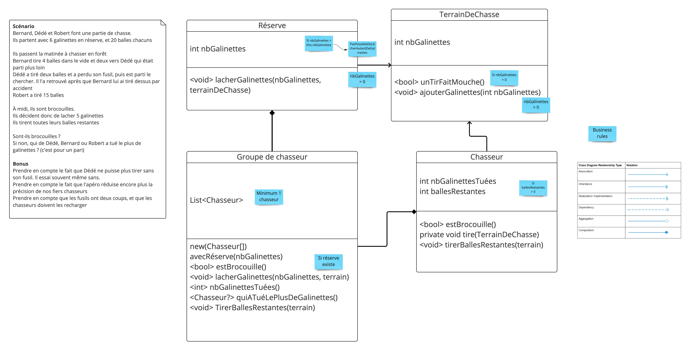

# Generate Code from its Usage
## Learning Goals
- Use code generation from the caller
- Efficiently use IDE shortcuts for code generation
- Understanding the value of IDE

## Connect
Name 3 situations where your IDE is :

- Faster
- More reliable 

than you

## Concepts
Demo the power of the IDE by generating code from the caller :

- Use not yet implemented code
- Generate the code from here
	- Demonstrate shortcuts to go back to the previous error
- Then extract classes from this file

> Do a first round only by using your mouse then do the same by using your keyboard.

## Concrete Practice - Chasseurs du Bouchonnois

- Implement the `scenario` and `classes` below by `using generating code from its usage`
- List the shortcuts you have discovered during the session

## Conclusion
Explain which shortcuts you would like to discover.