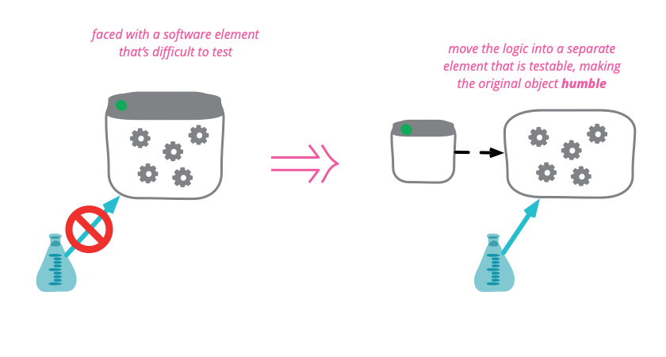

# Specification Pattern
## Learning Goals
Understand how the Specification Pattern can help us:
- Write more readable code
- Reuse rules between different entities

## Connect - Rule comprehension (5 min)
- Split the group in 2
  - In parallel groups have to identify clearly what are the rules implemented in their respected code snippet 
  - Give 1 minute to understand what is going on
  - Write in pure english

- Group 1 takes snippet 1 and group 2 takes snippet 2

`Snippet 1`
```c#
public int xXx(DateTime postedAfter) => 
            xXx2(
                _blogRepository.FetchAll(),
                postedAfter
            ).Length;

private Post[] xXx2(Blogs.Blog[] blogs, DateTime postedAfter)
{
    var results = new List<Post>();

    foreach (var blog in blogs)
    {
        if (!blog.Banned.HasValue)
        {
            if (blog.Activated.HasValue)
            {
                if (!blog.Removed.HasValue)
                {
                    if (!blog.Banned.HasValue)
                    {
                        foreach (var post in blog.Posts)
                        {
                            if (!post.Banned.HasValue)
                            {
                                if (post.Activated.HasValue)
                                {
                                    if (!post.Removed.HasValue)
                                    {
                                        if (!post.Banned.HasValue)
                                        {
                                            if (post.Created.CompareTo(postedAfter) == 1)
                                            {
                                                results.Add(post);
                                            }
                                        }
                                    }
                                }
                            }
                        }
                    }
                }
            }
        }
    }
    return results.ToArray();
}
```

`Snippet 2`
```c#
public int xXx(DateTime postedAfter)
            => _blogRepository
                .FetchAll()
                .Where(blog => new ActivatedBlogSpecification().IsSatisfiedBy(blog))
                .SelectMany(blog => blog.Posts)
                .Count(post => new ActivatedSpecification()
                    .And(new NotRemovedSpecification())
                    .And(new NotBannedSpecification())
                    .And(new CreatedAfterSpecification(postedAfter)).IsSatisfiedBy(post));
```

## Concepts (10 min)


- The specification pattern is a particular software design pattern, whereby :
  - Business rules can be recombined by chaining the business rules together using boolean logic.
  - It is frequently used in the context of domain-driven design

### Combinable
- A `specification pattern outlines a business rule` that is combinable with other business rules
  - A unit of business logic inherits its functionality from the abstract aggregate Composite Specification class
  - The Composite Specification class has one function called `IsSatisfiedBy` that returns a boolean value
- After instantiation, the specification is `chained` with other specifications
  - Making new specifications `easily maintainable` / `highly customizable business logic`

### Repository usage
- As a consequence of performing runtime composition of high-level business/domain logic :
  - It is a convenient tool for converting ad-hoc user search criteria into low level logic to be `processed by repositories`

### Testing impact
- Since a specification is an `encapsulation of logic` in a `reusable form` it is very simple to thoroughly unit test
- When used in this context is also an implementation of the [humble object pattern](https://martinfowler.com/bliki/HumbleObject.html)



## Concrete Practice (35 min)
- Take a few minute to discover what is inside the `Specification` project
- Implement the `BlogServiceV2` code with the missing `Specification(s)` to pass the tests

## Conclusion (5 min) - When should you use this?
Think about `when` to use it and on `which` piece of code

Implementation solution available [here](solution.md)