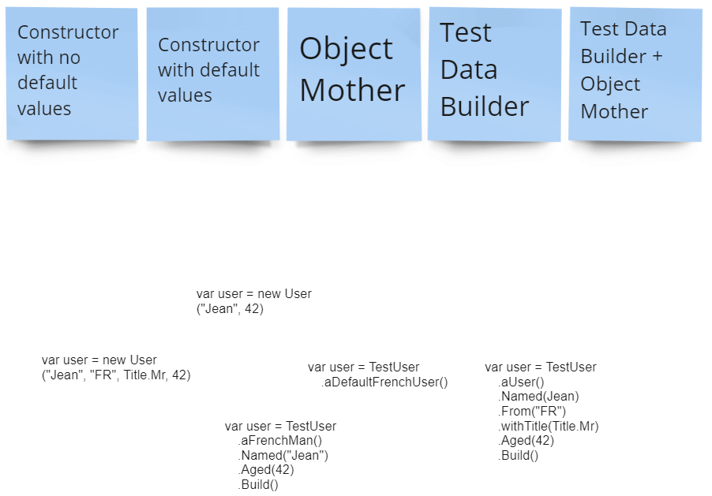

# Test Data Builder pattern
## Learning Goals
- Apply the Test Data Builder pattern to a project
- Understand how you can inject domain meaning in you test data builder

## Connect (3' + 5' discussion)
Associate the following code snippet with the corresponding pattern :
* Constructor with no default values
  ```C#
  var user = new User("Jean", "FR", Title.Mr, 42)
  ```
* Constructor with default values
  ```C#
  var user = new User("Jean", 42)
  ```
* Object Mother
  ```C#
  var user = TestUser.aDefaultFrenchUser()
  ```
* Test Data Builder
  ```C#
  var user = TestUser.aUser()
    .Named(Jean)
    .From("FR")
    .withTitle(Title.Mr)
    .Aged(42)
    .Build()
  ```
* Test Data Builder + Object Mother
  ```C#
  var user = TestUser.aFrenchMan()
   .Named("Jean")
   .Aged(42)
   .Build()
  ```

You may shuffle the code snippet and let the trainees associate them with patterns. It works on a tool like Miro :


This is also an occasion to explain what is the Object Mother pattern and the Test Data Builder pattern if needed.

### Connect alternative
An alternative could be to give snippets to the team and ask them if they think it is a good pattern or not.

 
## Concept (7')
Demo by creating a simple builder. Talk about naming to show the group that you can do better than withAttribute.

Using the [Book invoicing kata](https://github.com/pitchart/csharp-katas-log/tree/master/TestDataBuilders), you may write tests before the session, then create a simple builder for Country.

You can start by writing usage, then use your IDE to generate the class and methods (great side effect feature to show) :
```C#
var usa = CountryBuilder.ACountry()
                .Named("U.S.A.")
                .Using(Currency.UsDollar)
                .Speaking(Language.English)
                .Build();
```
Then the Builder :
```c#
using System;

public class CountryBuilder {
    private string _name { get; set; }
    private Currency _currency { get; set; }
    private Language _language { get; set; }
    
    public static CountryBuilder ACountry() {
        return new CountryBuilder();
    }
    
    public CountryBuilder Named(String name) {
        _name = name;
        return this;
    }
    
    public CountryBuilder Using(Currency currency) {
        _currency = currency;
        return this;
    }
    
    public CountryBuilder Speaking(Language language) {
        _language = language;
        return this;
    }
    
    public Country Build() {
        return new Country(_name, _currency, _language);
    }
}
```


## Concrete Practice
Let the group code, continue on the  [Book invoicing kata](https://github.com/pitchart/csharp-katas-log/tree/master/TestDataBuilders).

 Depending on their levels, they can start with a countryBuilder already done or redo it as a starting point.

You can show builder nesting, encourage them to add mother like extensions for most used objects, etc...

## Conclusion
Conclusion might be one of :
 * Explain the Test Data Builder pattern in one sentence
 * Could you apply this pattern in your project ? How ?
