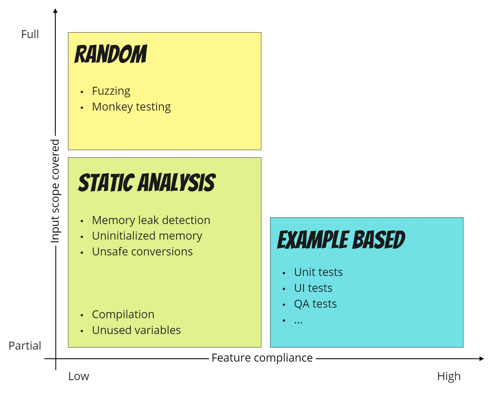

# Fuzzing Test Data Builders

## Learning Goals

- Understand fuzz testing
- Use a fuzzing library in your test data builders
- Improve tests readability

## Connect (3 min)

3 facts about example based tests

## Concepts (4 + 10 min)

- Do a presentation of fuzz testing
- Present a test fuzzing library and use it in a demo to to make an existing test data builder fuzzy

### Fuzz testing (4 min)

**Proving correctness of code**

- *Feature compliance:* Does it really test the feature I am trying to provide?
- *Input scope covered:* How well do I cover all possible inputs?

*How to file the gap between randomness and example based tests?*

**Fuzzers to the rescue!**

In example based tests, data used to build an object are rarely all involved in the scenario:

- involved data must be set invariant
- non involved data can be instantiated with random valid values, so they may be used to catch non-predicted behaviors

**Fuzzer principles**

- Generate random values, respecting some defined rules
  (eg: a random email, an address, a positive integer...)
- Use a seed if needed to reproduce an error

### Demo (10 min): Fuzz testing with the test data builders pattern

- use a fuzzing library to generate arbitrary data in the builders ([c#](./book-invoicing/csharp/README.md))
- explain how to set a seed to make generated data deterministic (eg: to reproduce an error)
- launch tests many times to see if some test fail
- focus on the tests : which values can we keep fuzzed and which values must be defined ?

## Concrete Practice (40 min)

- make the learners apply what you demonstrated
- help them do the same for other builders
- should we make all builders fuzzing ?

## Conclusion (3min) - Does our code have this issue?

Discuss in pair for 3 minutes on the question:

> Where can you use fuzzing test data builders in your codebase?

